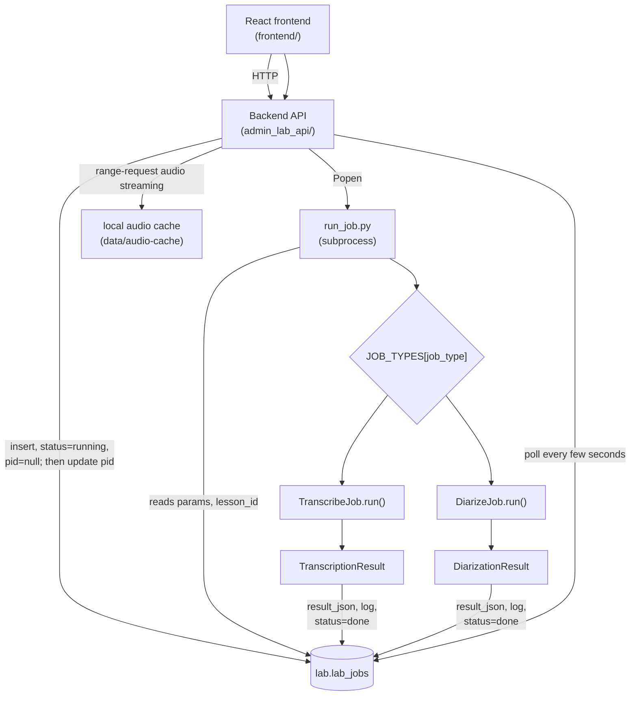
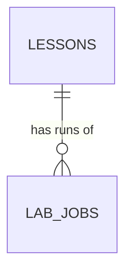

# Kol Torah — Admin & Lab

**Status:** Draft for review — not yet built
**Last updated:** 2026-08-12
**Code:** `frontend/` (React, planned) + `src/data_pipelines/lab/` and
`src/data_pipelines/admin_lab_api/` (Python, planned)

Supersedes `admin.md` (the Streamlit admin app) and the Streamlit/Chainlit stack
decisions in `design.md` §8.2 — see §1.2–§1.4.

---

## 1. Purpose and scope

One combined internal tool, replacing two separate things that were going to exist
otherwise: the Streamlit catalogue admin (`admin_app.py`/`admin.md`) and the
experimentation lab described in `design.md` §8. It covers three kinds of work:

- **Catalogue admin** — rabbi/series/lesson CRUD and browsing, currently
  `admin_app.py`. Unchanged in function, moved into this app.
- **Experimentation lab** — the first instance of `design.md` §8, applied to
  transcription and diarization (`design.md` §3): pick a lesson, run a job, look at the
  output, listen to the audio alongside it. See §2 onward for what this covers now, and
  §5.3/§5.4 for how it extends to future job types.
- **UI prototyping for the main website.** Trying out video/audio player choices and
  other interaction patterns against real lesson data, before they're built into the
  actual product (`../documentation/design/web-architecture.md`'s React Router SSR
  frontend). Not job-based, not backed by `lab_jobs` — a plain gallery of components
  exercised against real data, living in the same app because it's the same operator,
  the same data, and the same need for a real frontend. Scope of what gets prototyped
  here isn't decided yet; noted as a use case that shapes §1.2's stack decision, not
  specced further in this document.

The immediate goal, for the lab specifically, is still narrow: pick a lesson, run
transcription and/or diarization on its cached audio, look at the output, and listen to
the audio alongside it. Two follow-on goals are explicitly **not** this version's job,
but shape the design so nothing here blocks them:

- **Parameter tuning** — same job type, different `params` (beam size, `initial_prompt`,
  clustering threshold). Already supported by the run/params shape below; no new
  mechanism needed when this starts.
- **Merging transcription and diarization into one result** — assigning a speaker label
  to each transcript segment by timestamp overlap (`design.md` §3, deferred there too).
  This will be a new job type, not a new mechanism — see §5.3.

### 1.1 Revises `design.md` §7.1 — one database, not two

`design.md` §7.1 specifies two Postgres databases (`kol_torah`, `kol_torah_lab`) with
identical layout, and a subset-seeding script to copy production rows into the lab one.
That split exists to isolate experimentation from a live production system — but there
is no live production system yet; `kol_torah` currently serves as the only environment
there is. Building the two-database machinery this needs (a seeding script, cross-
database ID/sequence handling, a second connection string to manage) to isolate the lab
from something that doesn't exist yet is solving a problem this project doesn't have.

**This app instead adds a `lab` Postgres schema inside `kol_torah` itself**, alongside
the existing `public` schema (`rabbis`/`series`/`lessons`/`audio_files`/...). `lab_jobs`
(§5.1) lives in `lab.lab_jobs`, with a normal foreign key straight to
`public.lessons.id` — same database, same transaction, enforced by Postgres like any
other constraint. There is no seeding step: the lesson picker (§2) queries
`public.lessons` directly, live, filtered rather than copied.

**`design.md` §7.1/§7.3 have already been updated to match this** — this section states
the reasoning behind that revision, not a change still pending elsewhere. Revisit once a
real production environment exists separate from this dev database; at that point the
isolation §7.1 was designed for becomes a real requirement again, and the two-database
split (or some other boundary) is worth reinstating.

### 1.2 Revises `design.md` §8.2 — React, not Streamlit, for admin and lab together

`design.md` §8.2 picked Streamlit for the lab specifically because its core question —
"which of these configurations is best across these lessons" — is a table: rows,
columns, filtering, side-by-side comparison. That reasoning still holds for the
job-comparison parts of this tool. It stops holding for two things this tool also needs
to do:

- **Listening while comparing.** Clicking a transcript or diarization segment needs to
  seek a continuously-playing audio player instantly, ideally with the current segment
  highlighted as playback moves past it. Streamlit's rerun-per-interaction model means
  the closest approximation — re-rendering `st.audio(..., start_time=...)` on each click
  — reloads the audio element from scratch every time: no continuous playback across
  reruns, no live highlight, a beat of latency per click. This isn't fixable within
  Streamlit's execution model, only worked around.
- **UI prototyping for the main site** (§1). This only makes sense in a real
  component-based frontend — Streamlit has no role to play there at all.

Rather than run two frontend stacks for one operator's internal tooling, **admin, lab,
and UI prototyping become one React application.** This is a deliberate trade of a few
extra days of upfront build time for a UI substrate that's actually useful beyond this
one lab — accepted explicitly, not scope creep to be trimmed back later.

Backend: a Python API over the same SQLAlchemy models and job-execution code already
designed in §4/§5; the frontend talks to it over HTTP instead of Streamlit importing it
in-process. **Confirmed: FastAPI.**

The main product uses Django/django-ninja (`../documentation/design/web-architecture.md`),
but matching that stack here would mean pairing django-ninja with a non-Django ORM —
this repo already has one (SQLAlchemy models in `db/models.py`, the shared Alembic
chain), and running Django's ORM alongside it over the same tables risks the two
drifting out of sync. FastAPI has no ORM opinion of its own, so it sits cleanly on top
of what's already here. It also validates request/response bodies as Pydantic directly,
which `CLAUDE.md` already mandates everywhere else — `TranscriptionResult`/
`DiarizationResult` (§4.2) become the API schema as-is, no separate serialisation layer
to keep in sync by hand. And it doesn't force async: route handlers stay plain sync
SQLAlchemy (`Session`, not `AsyncSession`, run in FastAPI's threadpool automatically),
so `config.py`'s existing `get_settings()`/`create_engine()` pattern carries over
unchanged.

Local dev runs two processes — `uvicorn` for the API, Vite for the frontend — with
Vite's dev-server proxy pointed at `/api` rather than configuring CORS by hand.

One consequence worth flagging up front: the backend now needs to serve audio bytes
with HTTP range-request support, so the browser's `<audio>` element can seek without
downloading the whole file first. Streamlit's own media serving handled this internally
in the version this replaces; a hand-rolled API needs to do it explicitly.

`design.md` §8.2's other stack decision — Chainlit for the not-yet-started agentic
search prototype — isn't addressed by this change, and `design.md` (already updated to
reflect React for the lab, per §1.1) leaves it explicitly open there too: whether
Chainlit is still the right call now that the lab itself is React. Worth revisiting for
consistency once that prototype work actually starts, not decided here.

### 1.3 Revises `design.md` G8 — no auth for now

G8 ("the lab is authenticated... Google IdP via OIDC") assumed a hosted, shared lab.
Like §1.1's database split, that's solving for an environment that doesn't exist yet —
this runs locally, for one operator, so there's nothing to authenticate against. No auth
is built for now. Revisit alongside §1.1 once there's an actual shared/hosted deployment
of this tool, not before.

### 1.4 Supersedes `admin.md` and `admin_app.py`

The existing Streamlit admin app (`src/data_pipelines/admin_app.py`, specced in
`admin.md`) — rabbi/series CRUD, lesson browsing — is dropped, not kept alongside this.
Its functionality moves into this app instead, as ordinary CRUD screens over the same
catalogue tables. This lets an operator go from "here's a lesson in the catalogue" to
"run a transcription job on it" to "here are the results" without switching apps.
`admin.md` becomes stale once this lands; retiring or rewriting it is a follow-up, not
done as part of this document.

### 1.5 Job execution stays a direct subprocess per click

Not the queue-plus-worker model `design.md` §8.1 leaves open as an option. At this scale
(one lesson, one click, one operator) a worker process polling a queue is infrastructure
with no payoff yet. What §8.1 actually requires — the app never blocking on a run
in-process, and a page refresh never restarting or losing track of one — still holds;
see §4.3. Unaffected by the React/backend split in §1.2: the backend API process runs
`Popen`, same as the Streamlit process would have.

---

## 2. What this version does

- **Lesson picker.** Queries `public.lessons` directly (§1.1) — no seeding step.
  Filterable by rabbi, series, `lesson_type` (`database-schema.md` §4.4 — the actual
  column name; `design.md` §8.4 calls this selection axis "content type" in prose, but
  there is no `content_type` column), or an explicit lesson-id list (`design.md` §8.4's
  selection axes, applied live rather than copied), with local-cache status shown
  per row. Picking a lesson that's stored but not cached locally downloads it from the
  bucket on the spot (§4.6); a lesson with no `audio_files` row yet (not stored) is shown
  but disabled — there's no audio to run on.
- **Run panel.** Launch a transcription job and/or a diarization job for the selected
  lesson. If one is already running for that lesson, its live status is shown instead of
  a launch button — this is what makes a page refresh safe (§4.3).
- **Live status.** Polls `lab_jobs` (§5.1) on a short interval; per-job status, timing,
  and (once done) results appear without a full page reload.
- **Results view.** Transcript segments and diarization turns as two synced, clickable
  lists sharing one continuously-playing audio player — clicking a row seeks playback to
  that timestamp instantly, with the currently-playing segment highlighted as playback
  moves past it. Not merged (§1); side by side is enough to eyeball how well the two
  agree. Each diarization turn gets **two cues, not one**: a colour for host/not-host
  (a heuristic, computed client-side — see §4.7) and the raw speaker label
  (`SPEAKER_00`, `SPEAKER_03`, ...) as text alongside it. Diarization quality itself is
  still unknown at this point — showing both is what lets an operator tell whether the
  heuristic is right by checking it against the raw labels, not just trust it.
- **Log view.** The captured stdout/stderr of any completed job (success or failure), in
  a collapsed-by-default panel (§4.5).
- **Catalogue admin.** Rabbi/series/lesson CRUD, carried over from `admin_app.py` (§1.4).

### Explicitly out of scope for this version

- Batch/sweep running across many lessons — the picker's filter (§2) narrows which
  lessons are *available*, but running one job type across every filtered lesson with a
  single click, and tracking N jobs at once, isn't built. Nothing in the data model
  blocks this later (`design.md` notes the lab is never expected to run over more than a
  few dozen lessons anyway).
- The merge job type (§5.3).
- **Run comparison view** — pick two `lab_jobs` rows for a lesson, diff params and
  segments side by side. Needed, not optional: `design.md` §8.2's whole stated reason
  for the lab existing is "which of these configurations is best across these lessons,"
  which is a comparison question by definition. Sequenced after v1 only because it needs
  a second run of the same job type to exist before there's anything to compare.
- Ground-truth transcripts / WER measurement.
- Live log streaming while a job runs (§4.5).
- The UI-prototyping gallery's actual content (§1) — its existence shapes the stack
  decision; what goes in it is future work.

---

## 3. Diagram



---

## 4. Architecture

### 4.1 Job types: metadata and logic together

Each kind of job — transcription, diarization, and later the merge job — is one class,
not a data record plus a separate function. The class carries both its own identity
(what it is, which version, what changed) and the code that runs it, so there's exactly
one place to look to answer "what does this job actually do":

```python
class LabJob(ABC, Generic[ParamsT, ResultT]):
    key: ClassVar[str]
    description: ClassVar[str]
    version: ClassVar[str]
    version_notes: ClassVar[str]

    @classmethod
    @abstractmethod
    def params_model(cls) -> type[ParamsT]: ...

    @classmethod
    @abstractmethod
    def run(cls, ctx: JobContext) -> ResultT: ...
```

```python
class TranscribeJob(LabJob[TranscriptionParams, TranscriptionResult]):
    key = "transcribe"
    description = "Whisper transcription via ivrit.ai fine-tune"
    version = "1"
    version_notes = "Initial version: plain transformers pipeline, no chunking."

    @classmethod
    def params_model(cls) -> type[TranscriptionParams]:
        return TranscriptionParams

    @classmethod
    def run(cls, ctx: JobContext) -> TranscriptionResult:
        ...
```

No instance state, so no instantiation — everything is a classmethod, and the registry
maps key straight to class:

```python
JOB_TYPES: dict[str, type[LabJob]] = {
    TranscribeJob.key: TranscribeJob,
    DiarizeJob.key: DiarizeJob,
}
```

`params_model()` is a classmethod rather than a `ClassVar[type[ParamsT]]` because
`ClassVar` can't carry the class's own `TypeVar` — it means one concrete value shared
regardless of parametrization, which contradicts being generic over `ParamsT` in the
first place. A classmethod with a subclass-specific return type says the same thing
without that contradiction.

`version`/`version_notes` are a second, coarser versioning axis than the git SHA every
run already records (`design.md` invariant 4): git SHA changes on every commit
repo-wide, but most commits won't touch a given job's approach at all. `version` is
bumped by hand only when this job's algorithm meaningfully changes — a new clustering
method, chunking for long audio, a different merge strategy — with `version_notes`
saying what and why. Both get frozen onto the `lab_jobs` row at run time (§5.1), so a
row found later is self-describing even if the registry entry has since changed or been
removed — the same reasoning `design.md` §4.1 uses for freezing LLM cost onto a row
rather than recomputing it from current rates.

`JobContext` carries everything any job type might need — lesson, audio path, its own
typed params, and (once it exists) references to prior jobs' results for the merge job.
Each subclass pulls only what it needs; `run_job.py` (§4.3) never has to know the
difference between job types to dispatch one.

### 4.2 Params and results: typed, not `dict[str, Any]`

Per `CLAUDE.md`, both are Pydantic models, one pair per job type. Every job type's
params model shares one field via a common base, so `lab_jobs.model_id` (§5.1) can be
populated generically — reading `params.model_id` off whichever `ParamsT` came back from
validation, with no per-job-type branching to know where the model identifier lives:

```python
class JobParams(BaseModel):
    model_id: str
```

- `TranscriptionParams(JobParams)` (model variant, beam size, `initial_prompt`, ...),
  `TranscriptSegment` (start/end ms, text), `TranscriptionResult` (segments, model_id,
  params, elapsed_s, device).
- `DiarizationParams(JobParams)` (clustering settings), `DiarizationTurn` (start/end ms,
  speaker label), `DiarizationResult` (turns, model_id, params, elapsed_s, device).

`model_id` lives on `DiarizationParams` even though diarization currently has exactly
one model (`ivrit-ai/pyannote-speaker-diarization-3.1`, pinned, `design.md` §3) — that's
today's reality, not a constraint the schema should bake in. A future segmentation or
clustering-model swap becomes a new `DiarizationParams.model_id` value, not a schema
change to `lab_jobs` or to the generic model-id-extraction logic above.

`initial_prompt` is included in `TranscriptionParams` from the start even though tuning
it is deferred (`design.md` §9) — the model has to exist anyway, so there's no reason to
leave out a field that's already known to be worth trying.

These models are also the API's response schemas — FastAPI (§1.2) serialises Pydantic
directly, so there's no separate "wire format" to define and keep in sync by hand.

### 4.3 Job execution: subprocess, tracked in Postgres

Clicking "run" in the frontend calls the backend API, which inserts the `lab_jobs` row
first (status `running`, `pid` left `null`) to get an `id`, then does
`subprocess.Popen([sys.executable, "-m", "data_pipelines.lab.run_job",
str(job_id)])` — `run_job.py` needs that `id` as its own argument, so the row has to
exist before the subprocess can be started, which means the real OS pid can't be known
at insert time. The handler writes `pid` back onto the row immediately after `Popen`
returns, still within the same request, before responding to the frontend — so a caller
of `GET /lessons/{id}/jobs` essentially never observes a `running` row with a null
`pid`; §4.3's liveness check below treats one as dead if it ever does (crash between
insert and the pid write-back), the same as a pid that's gone stale.

**`sys.executable`, not `["uv", "run", "python", ...]`, confirmed during implementation.**
The API process is itself already started via `uv run uvicorn ...`, so `sys.executable`
already points at the right venv interpreter — no need to re-resolve the environment
per job launch. This isn't just simpler: going through `uv run` actually breaks the
liveness check below, because `uv run` forks a child python process rather than
exec-replacing itself, so the pid `Popen` returns would be the `uv` wrapper's, not the
worker's — `os.kill(pid, 0)` would then report the wrapper as alive/dead independently
of whatever the actual worker process is doing. `sys.executable` makes the tracked pid
the real worker, which is what the liveness check needs to mean anything.

**The liveness check also has to reap, not just probe.** This API process is the direct
parent of every job subprocess it launches, so a subprocess that has died is a *zombie*
until something calls `wait()` on it — and `os.kill(pid, 0)` reports a zombie as
"alive" the same as a running process, since it still holds a pid. The liveness check
(`data_pipelines.lab.jobs.is_alive`) calls `os.waitpid(pid, os.WNOHANG)` first — which
both reaps a finished child (so zombies don't accumulate for the server's lifetime) and
is how a just-died child is actually detected — before falling back to the plain
`os.kill(pid, 0)` existence check for pids that were never this process's child (e.g.
stale ones from a previous server run). Confirmed against a real `kill -9` mid-run:
without the `waitpid` reap, the killed job stayed reported as `running` indefinitely.

This is what makes a page refresh safe, per `design.md` §8.1's underlying requirement:
the frontend holds no run state of its own — the run panel's "is something already
running for this lesson" check is an API call backed by a `lab_jobs` query, not
anything cached client-side — so a refresh just re-fetches current status instead of
launching a second subprocess.

`run_job.py`:

1. Loads the `lab_jobs` row, resolves the lesson's local audio path.
2. Looks up `JOB_TYPES[row.job_type]`, validates `row.params` against
   `job_cls.params_model()`, builds a `JobContext`.
3. Calls `job_cls.run(ctx)` inside the log-capturing context manager (§4.5).
4. On success: writes `result_json`, `log`, `status="done"`, `ended_at`.
5. On an ordinary Python exception: writes `error`, `log`, `status="failed"`,
   `ended_at`, then re-raises (so the subprocess still exits non-zero).

A `running` row whose `pid` is no longer alive (`os.kill(pid, 0)` raising
`ProcessLookupError`) — or whose `pid` is still `null` past the brief insert-then-Popen
window above — means the subprocess died (or never started) without updating its own
status — a hard kill, not a caught exception (§4.5 covers which failures that includes).
The frontend surfaces this as "process appears to have died" with a manual retry, rather
than silently guessing at what happened.

### 4.4 Results live in Postgres, not the filesystem

`result_json` is a `jsonb` column directly on the `lab_jobs` row, not a separate file.
Job tracking already requires Postgres (§4.3), and a `jsonb` blob column commits to
exactly as little schema as a JSON file would — it isn't decomposed into per-segment
rows — so there was nothing to gain from a second storage mechanism, only a new way for
a row and a file to disagree (a job marked `done` with no matching file, or vice versa).
If a future need (e.g. querying inside results across many runs) calls for decomposing
this into real columns or child tables, that's a migration on this one column, not a
storage-layer rewrite — nothing else in the lab talks to the filesystem for results.

### 4.5 Logging: `print()`, captured, written once at completion

Job code — `TranscribeJob.run()`, `DiarizeJob.run()`, and anything they call — uses
plain `print()`. No `logging` setup, no bespoke logging API to learn; this is a lab, and
stdout is enough.

`run_job.py` wraps the call in a context manager that tees stdout and stderr into an
in-memory buffer while still passing them through to the real streams (so the
subprocess is still watchable directly, e.g. during development outside the app):

```python
@contextmanager
def capture_job_log() -> Iterator[io.StringIO]:
    buffer = io.StringIO()
    with redirect_stdout(_Tee(sys.stdout, buffer)), redirect_stderr(_Tee(sys.stderr, buffer)):
        yield buffer
```

The buffer is written to `lab_jobs.log` once, at completion — from the same success/
failure paths in §4.3 that write `result_json`/`error`. **Deliberate simplification:** a
hard kill (OOM-killer, segfault) loses whatever was in the buffer, since nothing after
that point in the process ever runs. An ordinary Python exception — including
`torch.cuda.OutOfMemoryError`, which is catchable — is still captured in full, since
`run_job.py`'s `except` block runs before the process exits. If a hard kill turns out to
lose something actually needed, the fix is flushing the buffer to the DB periodically
during the run rather than only at the end; not built until that's a real problem.

### 4.6 Auto-download from the bucket

A lesson that's stored (`audio_files` row exists) but not present under
`local_cache_dir` (`config.py`) is downloaded when selected — `storage.py` gains a
`download_from_bucket(storage_key, dest_path)`, the missing counterpart to the existing
`upload_to_bucket`. The backend API runs this synchronously within the request (the
frontend shows a loading state), rather than as a tracked subprocess: unlike a
multi-minute model run, a single file download is short enough that blocking on it isn't
worth the tracking machinery in §4.3.

### 4.7 Host/not-host is a display-time heuristic, not a stored field

`DiarizationTurn` (§4.2) stores exactly what `pyannote` returns — a raw speaker label
per turn, nothing else. Which label (if any) is "the host" is computed in the frontend
from that data (starting point: total speaking duration per label, matching
`design.md` §3's observation that the host was the single dominant label on the test
lesson) — not written back to `result_json`, and not a new column.

This is deliberate, not a shortcut: the heuristic itself is unproven (§8), so the whole
point of this view is to let it be checked against the raw labels, not trusted. Keeping
it purely client-side means trying a different heuristic is an edit to display code, not
a migration or a rerun of already-completed jobs — cheap exactly where cheapness matters
while the rule is still being figured out.

### 4.8 Long-lesson navigation: virtual scroll plus time-jump

A two-hour Q&A show produces hundreds of segments and turns. Two decisions, not one:

- **Virtual scroll, not pagination.** The segment/turn lists render only the rows
  currently in view (via a list-virtualization approach — `@tanstack/react-virtual` or
  `react-window`; which one isn't decided, and doesn't need to be for this document),
  recycling DOM nodes as the operator scrolls. This is purely a client-side rendering
  technique over data already fetched in one piece — `result_json` (§4.4) isn't
  paginated server-side, the whole thing comes back in one API response, same as a short
  lesson's.
- **A ±15-minute jump control above the lists.** Not a per-list control — one control,
  shared, since both lists (§2) already track one playback position. Jumping moves that
  shared position: the audio player's `currentTime` and the scroll offset of both
  virtualized lists move together, the same sync already used for click-to-seek (§2) —
  jumping is just a coarser way of moving the same shared position, not a separate
  mechanism.

---

## 5. Data model

### 5.1 `lab_jobs`



| Column               | Type        | Constraints                     | Notes                                                        |
| -------------------- | ----------- | -------------------------------- | -------------------------------------------------------------- |
| `id`                 | bigint      | PK                                |                                                                  |
| `lesson_id`           | bigint      | FK → `lessons.id`, not null        |                                                                  |
| `job_type`            | text        | not null                           | registry key — `"transcribe"`, `"diarize"`, later `"merge"`     |
| `job_version`         | text        | not null                           | frozen copy of `LabJob.version` at run time                     |
| `job_description`     | text        | not null                           | frozen copy of `LabJob.description`                             |
| `job_version_notes`   | text        | not null                           | frozen copy of `LabJob.version_notes`                            |
| `status`              | text        | not null                           | `"running"` \| `"done"` \| `"failed"`                            |
| `pid`                 | int         | nullable                           | of the `run_job.py` subprocess — `null` only in the brief window between the row's insert and the `Popen` call returning (§4.3) |
| `params`              | jsonb       | not null                           | the job's typed params (§4.2), serialised                       |
| `model_id`            | text        | not null                           | duplicated out of `params` for queryability without JSON paths  |
| `result_json`         | jsonb       | nullable                           | populated on success — see §4.4                                 |
| `log`                 | text        | nullable                           | captured stdout/stderr — see §4.5                                |
| `error`               | text        | nullable                           | populated on failure                                             |
| `started_at`          | timestamptz | not null, default now()            |                                                                  |
| `ended_at`            | timestamptz | nullable                           |                                                                  |
| `git_sha`             | text        | not null                           | per `design.md` invariant 4                                     |
| `git_dirty`           | boolean     | not null                           | per `design.md` invariant 4                                     |

Lives in a new `lab` Postgres schema inside `kol_torah` (§1.1), created by its own
migration (`CREATE SCHEMA IF NOT EXISTS lab`, then the table) — the `public` schema and
everything in it is untouched by this. `lesson_id` is a plain foreign key to
`public.lessons.id`; unqualified, it resolves against `public` via the default search
path, so no schema-qualification is needed on the reference itself.

### 5.2 Why one flat table instead of `job_type`-specific tables

`params` and `result_json` are opaque blobs from the database's point of view precisely
because different job types need different shapes there, and that set of shapes is
still changing (a merge job is coming). A single table keyed by `job_type` means the
lesson picker's "what's been run on this lesson" view doesn't need a `UNION` across
per-type tables, and adding the merge job type is a new `LabJob` subclass and a new
registry entry — no migration.

### 5.3 Extensibility for the merge job

When transcript/diarization merging (`design.md` §3) is ready to build, it becomes
`class MergeJob(LabJob[MergeParams, MergeResult])` with `key = "merge"`, registered
alongside the other two. Its `run()` differs from the other two in what it actually
needs — prior `TranscribeJob`/`DiarizeJob` results rather than raw audio — which is
exactly what `JobContext` (§4.1) already accommodates: it's built by `run_job.py` per
job type, not a fixed signature every type must conform to. No schema change on
`lab_jobs`.

### 5.4 The `lab` schema outlives this lab

`lab` is a general-purpose scratch namespace, not a transcription-specific one. Once
transcription/diarization settle on a configuration, real production tables (e.g.
`transcripts`, `segments`) get added to `public` and populated by the actual pipeline
stage — matching `design.md` §8.5 ("nothing is copied from the lab into production...
once a configuration wins, it is run against production from scratch"). `lab.lab_jobs`
itself is never promoted, only the decision it informed is. The next lab (citation
extraction, summarisation, ...) reuses the same `lab` schema, adding its own tables or
`LabJob` subclasses (§4.1) as needed, rather than getting a schema of its own. Cleaning
out old `lab` schema content between labs is a manual operator choice, not an automated
policy — nothing here assumes it happens on any particular schedule.

---

## 6. Module layout

```
frontend/                          # React app — catalogue admin, lab job UI, UI
                                    # prototyping gallery (§1)
    src/
    package.json

src/data_pipelines/
    lab/
        models.py       # TranscriptionParams/Segment/Result, DiarizationParams/Turn/Result, JobContext
        job.py           # LabJob base class
        transcribe.py    # TranscribeJob
        diarize.py       # DiarizeJob
        job_types.py     # JOB_TYPES registry
        jobs.py          # lab_jobs CRUD: create/mark_done/mark_failed/get/list_for_lesson, liveness check
        log_capture.py   # capture_job_log() context manager
        run_job.py       # subprocess entrypoint: uv run python -m data_pipelines.lab.run_job <job_id>
    admin_lab_api/        # backend API the React app talks to: catalogue CRUD, job
                            # launch/status/results, audio streaming with range support
```

`lab/transcribe.py`/`diarize.py` hold the actual model-loading and inference code — no
API or DB-session-management import, so they're reusable later by the real pipeline
stage 4, not just by this app. `admin_lab_api/` is the only new code that's genuinely
tied to this being a web app rather than a script.

---

## 7. New dependencies and config

**Python dependencies** (`pyproject.toml`): `torch`, `transformers`, `pyannote.audio`,
`soundfile` — versions matching what `design.md` §3 already hand-tested on this
aarch64/CUDA 13 machine — plus `fastapi` and `uvicorn` for `admin_lab_api/` (§1.2).

**Frontend dependencies** (new `frontend/package.json`): React, TypeScript, Vite (build
tooling and dev server — its `server.proxy` is what routes `/api` to `uvicorn` in dev
without hand-configuring CORS, per §1.2), and React Router in client/SPA mode (not its
SSR "framework mode" — no server-rendering need for a local, single-operator tool). Type
discipline matches the Python side: no `any` without a documented reason, per
`CLAUDE.md`.

**`Settings`** (`config.py`): `hf_token: SecretStr` — required for diarization per
`design.md` §3's note on `pyannote.audio` 4.x unconditionally loading a gated component
at init. Not yet in `Settings`; currently missing entirely. Goes in `.env` like every
other secret, never a bare `os.environ` read.

No new `Settings` field for lab output — §4.4 means there's no `data/lab-runs/`
directory to configure.

**`Settings`/`database_url()` simplify, not grow.** §1.1 means there's only one database
to connect to. `config.py`'s existing `lab_db` setting and the `lab: bool` parameter on
`database_url()` (added for the `kol_torah`/`kol_torah_lab` split) become dead code once
this lands, not something this app adds to — same for `alembic/env.py`'s `-x db=lab`
argument.

---

## 8. Open questions, deferred rather than blocking

- **UI-prototyping gallery scope.** §1 names the use case (video/audio players, other
  interaction patterns for the main site); what actually goes in it, and whether
  anything built there ever graduates into the `web` repo directly, is undecided.
- **Chainlit consistency.** `design.md` §8.2 still names Chainlit for the not-yet-started
  agentic search prototype. Chainlit may still be the right test environment once that
  agent work starts — genuinely undecided until then, not something this document
  resolves.
- **The host-detection heuristic itself.** §4.7 decides *how* it's shown (colour plus
  raw label, computed client-side); *which* rule actually identifies the host is still
  unknown — total-duration-per-label is the starting guess (`design.md` §3's finding on
  one test lesson), not a validated rule. Expect this to change once diarization has run
  on more than one lesson; §4.7's client-side-only choice is what makes that cheap.
- **Long-lesson handling.** A two-hour Q&A show produces hundreds of segments; no
  pagination or length warning is designed yet — though a real frontend with proper list
  virtualization should handle this more easily than the Streamlit version would have.
- **Ground truth / WER.** Useful once parameter tuning starts in earnest; not needed to
  try the models for the first time.
- **Live log streaming.** Deferred per §4.5, only worth building if the write-once
  version turns out to lose something a hard kill would have shown.
