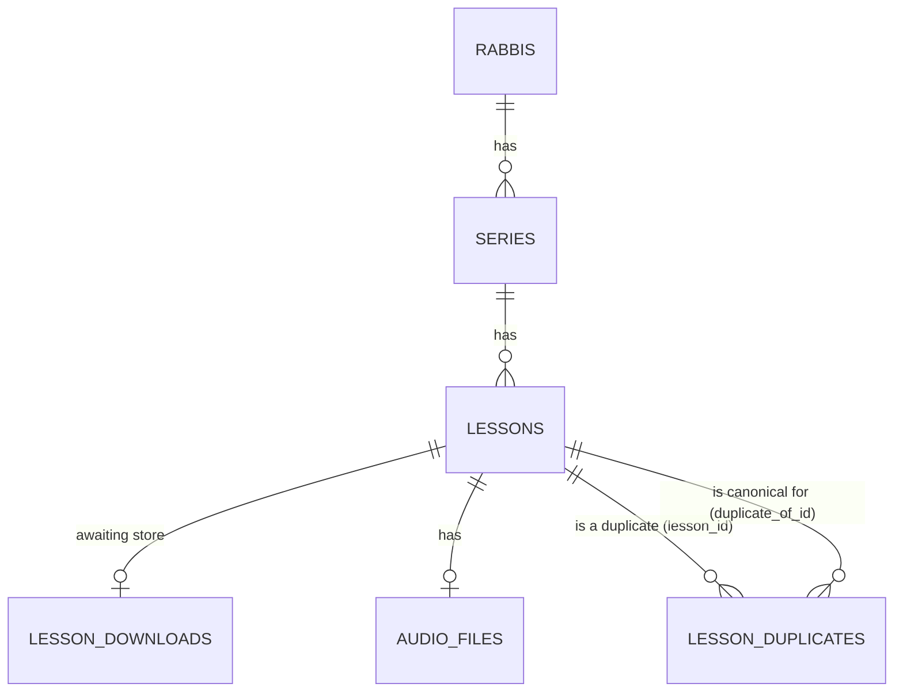

# Kol Torah — Database Schema: Discover / Download / Store

**Status:** Draft for review
**Last updated:** 2026-08-10

---

## 1. Scope

This document specifies the tables needed for the first slice of the pipeline: turning a
rabbi's series into a catalogue of discovered lessons with their audio safely stored,
per `documents/design.md` §2.1, stages 1–3 (Discover, Download, Store).

**Explicitly out of scope here:** transcription and everything after it, and the
`runs` / `stage_runs` tracking tables from design.md §7.2. Both are deferred to the next
design pass, once transcription forces the question of what per-stage tracking should
actually look like. See §5 for what that means for this slice in the meantime.

---

## 2. Entity overview

A rabbi has many series; each series is worked by exactly one adapter (a Python class,
not a database concept — see §4.1) and produces many lessons; each lesson has at most
one audio file, and may be flagged as a duplicate of another lesson. A lesson also has
at most one `lesson_downloads` row, but only transiently — it exists solely in the
window between a lesson being downloaded and being stored (see §3.4a).

---

## 3. Tables

### 3.1 `rabbis`

| Column       | Type          | Constraints        | Notes                          |
| ------------ | ------------- | ------------------- | ------------------------------- |
| `id`         | bigint        | PK                  |                                  |
| `name_he`    | text          | not null             |                                  |
| `name_en`    | text          | not null             |                                  |
| `slug`       | text          | not null, unique     | used in storage keys (§4.2)     |
| `created_at` | timestamptz   | not null, default now() |                              |

The root of the catalogue. Nothing pipeline-specific lives here yet — just enough to
group series by who taught them and to give admin tooling something to list.

Both names are required, not one primary plus a later translation: rabbis and series are
entered by hand (§5, admin interface), so whoever adds one is expected to supply both
immediately. That's different from lesson titles below, which are scraped from the
source and only ever arrive in Hebrew.

### 3.2 `series`

| Column         | Type        | Constraints            | Notes                                             |
| -------------- | ----------- | ------------------------ | -------------------------------------------------- |
| `id`           | bigint      | PK                        |                                                     |
| `rabbi_id`     | bigint      | FK → `rabbis.id`, not null |                                                   |
| `name_he`      | text        | not null                   |                                                     |
| `name_en`      | text        | not null                   |                                                     |
| `slug`         | text        | not null, unique           | used in storage keys (§4.2)                        |
| `lesson_type`  | text        | not null                   | plain string for now — see §4.4                    |
| `adapter_key`  | text        | not null                   | registry key resolving to a Python adapter class   |
| `description_he` | text      | nullable                   |                                                     |
| `description_en` | text      | nullable                   |                                                     |
| `created_at`   | timestamptz | not null, default now()    |                                                     |

A series is one rabbi's recurring thing — a weekly *shiur*, a *halacha yomit* run, a
radio show — and the unit an adapter is written against. `adapter_key` is a lookup
string (e.g. `"butbul.halacha_yomit"`), not a foreign key to a database row: the
adapter's actual behaviour (which playlists/feeds to pull, how to filter a mixed
playlist down to the right videos) lives in that Python class, not in this table. See
§4.1 for why, and what would change if that stops being true.

### 3.3 `lessons`

| Column          | Type        | Constraints                          | Notes                                                        |
| --------------- | ----------- | --------------------------------------- | -------------------------------------------------------------- |
| `id`            | bigint      | PK                                       |                                                                  |
| `series_id`     | bigint      | FK → `series.id`, not null               |                                                                  |
| `external_id`   | text        | not null                                 | platform-native id (e.g. YouTube video id)                     |
| `url`           | text        | not null                                 |                                                                  |
| `title_he`      | text        | not null                                 | scraped from the source (G1: lessons are almost always Hebrew) |
| `title_en`      | text        | nullable                                 | filled in later by an AI translation stage — see §5             |
| `description_he` | text       | nullable                                 | not every source provides one                                  |
| `description_en` | text       | nullable                                 | filled in later by an AI translation stage — see §5             |
| `lesson_type`   | text        | not null                                 | usually copied from `series.lesson_type`, overridable per lesson |
| `published_at`  | timestamptz | nullable                                 | when the platform published it                                 |
| `recorded_at`   | timestamptz | nullable                                 | actual event date, when known separately from `published_at`   |
| `discovered_at` | timestamptz | not null, default now()                  | when the discover step first saw it                             |

**Unique constraint on `(series_id, external_id)`.** This is what makes discovery
idempotent: re-running an adapter over a playlist it has already scanned just re-derives
rows it can skip inserting, rather than needing its own cursor or checkpoint.

`published_at` and `recorded_at` are both nullable and both optional independently —
you described usually having a publish date and sometimes a separate, earlier recording
date, so neither is guaranteed and they are not the same field.

### 3.4 `audio_files`

| Column         | Type        | Constraints                              | Notes                                              |
| -------------- | ----------- | ------------------------------------------ | ---------------------------------------------------- |
| `id`           | bigint      | PK                                           |                                                       |
| `lesson_id`    | bigint      | FK → `lessons.id`, not null, unique          | one audio file per lesson (deterministic half, §2 of design.md) |
| `content_hash` | text        | not null, indexed                            | hash of the extracted audio, computed before upload  |
| `storage_key`  | text        | not null, unique                             | shared path fragment for bucket and local cache — see §4.2 |
| `format`       | text        | not null                                     | codec/container of the stored audio, e.g. `opus`     |
| `duration_s`   | numeric     | not null                                     |                                                       |
| `bytes`        | bigint      | not null                                     |                                                       |
| `created_at`   | timestamptz | not null, default now()                      |                                                       |

**Existence of this row is the completion marker for download + store**, for now. No
audio file row yet means the lesson still needs work; a row means it's fully downloaded,
extracted, hashed, and uploaded. See §5 for why this is enough without a `stage_runs`
table at this stage, and what's missing because of it.

`content_hash` is computed on the **extracted, audio-only file**, not the raw
platform-served download — hashing a raw YouTube container tells you nothing about
whether the same lesson was reposted as, say, an mp3 on a podcast feed, since the
container and encoding differ even when the underlying recording is identical.

### 3.4a `lesson_downloads`

| Column          | Type        | Constraints                | Notes                                              |
| --------------- | ----------- | --------------------------- | ---------------------------------------------------- |
| `lesson_id`     | bigint      | PK, FK → `lessons.id`        | one row per lesson, deleted once stored              |
| `local_path`    | text        | not null                    | where the download stage wrote the file              |
| `bytes`         | bigint      | not null                    | size at the moment the download completed            |
| `downloaded_at` | timestamptz | not null, default now()     |                                                       |

A side table between design.md §2.1's Download and Store stages, existing only for the
window between them — inserted when a download finishes, deleted once the store step
consumes it (§3.4). Deliberately narrower than a general `stage_runs` table (§5): it
isn't per-stage timing or a job queue, it's a single "this specific download
completed" signal for the one place that turned out to need one.

The reason it needs to be a table rather than "check whether a file exists at the
expected path" (which is exactly how the *post-store* local cache works, §4.2): a
download that dies partway through — network drop, disk full, process killed — can
leave a real, non-empty file sitting at that path. Filesystem presence alone can't
distinguish that from a complete download; a database row can, because it's only
written *after* the file is fully in place. The store stage trusts the row, not the
glob.

`bytes` is recorded at download time, not because store re-verifies it (it doesn't,
yet), but so a corrupted-after-the-fact file — modified or truncated after being
staged — is at least visible on inspection as a size mismatch.

### 3.5 `lesson_duplicates`

| Column            | Type        | Constraints                       | Notes                                        |
| ----------------- | ----------- | ------------------------------------ | ----------------------------------------------- |
| `lesson_id`       | bigint      | PK, FK → `lessons.id`                 | the lesson identified as a duplicate            |
| `duplicate_of_id`  | bigint      | FK → `lessons.id`, not null           | the canonical lesson it duplicates              |
| `method`          | text        | not null                              | e.g. `content_hash`                             |
| `score`           | numeric     | nullable                              | null for hash matches (equality, not a score) — used once transcript-similarity dedup exists |
| `decided_at`      | timestamptz | not null, default now()               |                                                  |

`lesson_id` is the primary key: a lesson can only be a duplicate of one canonical
lesson. This table only gets pass-1 hash matches for now (design.md §2.3) — pass 2
(transcript similarity) needs transcripts, so it's out of scope until the transcription
slice exists, but the table shape already accommodates it via `method` and `score`.

---

## 4. Design decisions and rationale

### 4.1 One adapter class per series, not shared config

Series-level filtering (e.g. picking one weekly video out of a playlist that also
contains unrelated content) is closer to arbitrary code than to a declarative filter a
config schema could express cleanly. Rather than build a config DSL to avoid writing
Python, each series gets a bespoke adapter class, keyed by `series.adapter_key`, with a
base class per platform (e.g. `YouTubePlaylistAdapter`) providing shared mechanics —
fetching, pagination, invoking `yt-dlp` — via inheritance. Series-specific source
locations (playlist IDs, feed URLs) live as constants inside the adapter class, not in
the database.

This is a starting point, expected to be refactored as more series are onboarded and
patterns repeat — at which point moving source locations into a database table (so
adding a playlist becomes an admin action instead of a code change) becomes worth its
complexity. Nothing in this schema blocks that later move; it just isn't built now.

### 4.2 Storage key shared between bucket and local cache

`audio_files.storage_key` is a path fragment like
`{rabbi_slug}/{series_slug}/{external_id}.{format}` — persisted once at store time, not
re-derived on demand. The bucket URI and local cache path are both built by prepending
the appropriate root to this same fragment:

- Bucket: `s3://{bucket}/{storage_key}`
- Local cache: `{cache_root}/{storage_key}`

Persisting the key (rather than recomputing it from the current rabbi/series slugs each
time) means a later rename doesn't silently move where an already-stored lesson's audio
lives. It also keeps the column provider-neutral: a future move from S3 to GCS (an open
question in design.md §9) changes only how the bucket root is constructed, not this
table.

The **post-store** local cache still has no existence flag in the database. It is
genuinely a cache: files may be deleted by hand at any time (manual cleanup, for now —
see §5), so any code that wants to know whether a stored lesson's audio is available
locally must check the filesystem directly
(`Path(cache_root / storage_key).exists()`) rather than trust a stored boolean that
could go stale the moment someone deletes a file. This is unrelated to
`lesson_downloads` (§3.4a): that table isn't a cache-presence flag either — it's a
completion signal for a specific handoff between two stages, populated only once and
deleted once consumed, not a long-lived flag anyone would expect to stay in sync with
manual filesystem changes.

### 4.3 Bilingual names and descriptions, but not uniformly required

`rabbis` and `series` get `name_he`/`name_en` as two **required** columns, because those
rows are hand-entered and both names are known at creation time. `series` also gets
`description_he`/`description_en`, both **nullable** — unlike the name, a description is
optional content even when hand-entered, so there's no reason to force an English one at
creation time just because a Hebrew one exists.

`lessons` gets `title_he`/`description_he` (from the source, so `title_he` is required
per design.md G1 — lessons are almost always Hebrew — while `description_he` stays
nullable since not every source provides one) and `title_en`/`description_en`, both
nullable and populated later by an LLM translation step that doesn't exist yet (§5).

### 4.4 `lesson_type`, not `content_type`

Named `lesson_type` (on both `series` and `lessons`) rather than `content_type`, since
`content_type` is a term already used elsewhere. It's a plain text column rather than a
Postgres enum for now — the four shapes design.md §2.2 describes (long single-topic,
series, short single-topic, Q&A/radio) are a reasonable starting set, but locking them
into an enum before more series are onboarded (e.g. before deciding where video clips
fit) risks a migration to loosen it almost immediately. Tightening a text column into an
enum later is a cheap migration once the real set of values is known.

---

## 5. Deliberately deferred

- **Per-stage tracking (`runs` / `stage_runs`).** Design.md §7.2 describes a tracking
  table shared across the whole pipeline, including columns (`cost_usd`, `provider`,
  token counts) that only make sense for LLM-calling stages. Building it now would mean
  a table mostly full of nulls for download/store, for no present benefit — you don't
  want per-step timing for a fetch/extract/upload sequence, and idempotency for this
  slice is already covered by "does an `audio_files` row exist for this lesson." Revisit
  once transcription needs real stage tracking, and fold discover/download/store into
  whatever that design turns out to be.
  - **Known gap from deferring this:** no durable record of a *failed* download/store
    attempt (errors go to application logs, not the database, for now) — `lesson_downloads`
    (§3.4a) records a download's *success*, not its attempts, so a lesson that failed
    to download is indistinguishable from one that was never tried. Acceptable while
    this runs by hand; worth revisiting once it runs as an unattended daily job.
- **`series_sources` table.** Discussed and intentionally not built yet — see §4.1.
- **Lesson translation.** `lessons.title_en` and `lessons.description_en` exist so those
  columns don't need a migration later, but nothing populates them yet — that's an LLM
  stage (experimental half, per design.md §2) to design when translation is actually
  being built.
- **Cache eviction.** Local cache is cleared manually for now. An eviction policy is a
  problem for when the pipeline runs unattended and fetches new lessons daily, not
  before.
- **`lesson_type` enum.** See §4.4.
- **Admin interface for adding rabbis/series.** Not yet decided whether this is a
  Streamlit page in the lab or a standalone script — doesn't affect the schema either
  way, so deferred until the tables exist to build against.
