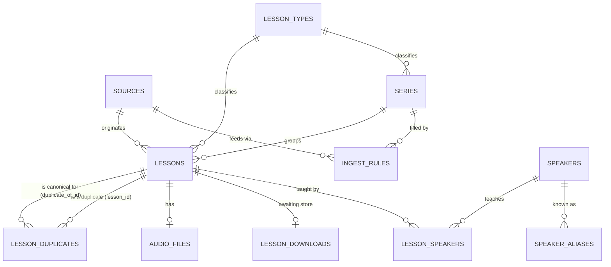

# Kol Torah — Database Schema: Discover / Download / Store

**Status:** Current — reflects the catalogue redesign
**Last updated:** 2026-09-03

---

## 1. Scope

This document specifies the tables needed for the first slice of the pipeline: turning a
rabbi's series into a catalogue of discovered lessons with their audio safely stored,
per `documents/design.md` §2.1, stages 1–3 (Discover, Download, Store).

**Explicitly out of scope here:** transcription and everything after it, and the
`runs` / `stage_runs` tracking tables from design.md §7.2. Both are deferred to the next
design pass, once transcription forces the question of what per-stage tracking should
actually look like. See §5 for what that means for this slice in the meantime.

---

## 2. Entity overview



Three things this shape says, each of which the previous one could not:

- **A series has no speaker.** It is an editorial grouping — a thing to browse — and who
  taught a lesson is a fact about the lesson (`lesson_speakers`, §3.5), which may be
  nobody or two people. "Who teaches this series" is the `series_speakers` view (§4.6).
- **A lesson belongs to a source**, and `(source_id, external_id)` is unique: one video is
  one lesson however many rules claim it, so it downloads and transcribes once.
- **Where lessons come from is data, not code.** A source is a channel or site we poll; an
  ingest rule says how one series is filled from one source. A source feeds many series
  (one kolel channel, five series); a series may draw on several of a source's playlists
  (one per Hebrew year).

Full rationale in `documents/plans/catalogue-redesign-plan.md`.

## 3. Tables

### 3.1 `speakers`

| Column       | Type          | Constraints             | Notes |
| ------------ | ------------- | ----------------------- | ----- |
| `id`         | bigint        | PK                      |       |
| `name_he`    | text          | not null                | carries the honorific — `הרב אהרון בוטבול` |
| `name_en`    | text          | not null                | `Rabbi Aharon Butbul`, `Dr. Michael Abulafia` |
| `slug`       | text          | not null, unique        | `r-` prefixed: `r-butbul`, `r-almog-levi` |
| `created_at` | timestamptz   | not null, default now() |       |

Was `rabbis`. Renamed because the institutional channels also carry doctors, professors,
a `הרבנית` and lay teachers (`documents/pipelines/kolel-channels.md` §2) — the old name
could not hold them honestly. The honorific lives *in* the name, which is what keeps
"most of these are rabbis" visible despite the table's name; the `r-` slug prefix is a
namespace, not a claim about ordination.

Both names are required, not one primary plus a later translation: speakers and series
are entered by hand (§5, admin interface), so whoever adds one supplies both immediately.
That differs from lesson titles below, which are scraped and only ever arrive in Hebrew.

### 3.1a `speaker_aliases`

| Column       | Type   | Constraints          | Notes |
| ------------ | ------ | -------------------- | ----- |
| `name_he`    | text   | **PK**               | one spelling maps to exactly one speaker |
| `speaker_id` | bigint | FK → `speakers.id`, not null, indexed | |

The name itself is the primary key, not a surrogate: that is what guarantees a spelling
can never resolve to two speakers. Matching on the **whole** name is also what keeps the
substring traps out — `אבוטבול` contains `בוטבול`, `לוינשטיין` contains `לוי`, and both
are different people (kolel-channels.md §3.2). `אהרן בוטבול` and `אהרון בוטבול` both map
to `r-butbul`; `הרב אודי שורץ` and `הרב אודי שוורץ` are another such pair.

Fixing a misattribution is an admin edit, not a code change — and because
`lessons.speaker_raw` (§3.3) keeps what the source actually said, adding an alias
re-resolves past lessons without re-scraping.

### 3.1b `lesson_types`

| Column       | Type   | Constraints      | Notes |
| ------------ | ------ | ---------------- | ----- |
| `id`         | bigint | PK               |       |
| `slug`       | text   | not null, unique | `halacha`, `gemara`, `tanach`, … |
| `name_he`    | text   | not null         |       |
| `name_en`    | text   | not null         |       |
| `sort_order` | bigint | not null, default 0 | so the UI isn't alphabetical by accident |

Replaces the free string. A side table rather than a PG enum: adding a value is a row,
not a migration, and the admin UI can list them. Vocabulary and rationale in §4.4.

### 3.1c `sources`

| Column        | Type        | Constraints             | Notes |
| ------------- | ----------- | ----------------------- | ----- |
| `id`          | bigint      | PK                      |       |
| `slug`        | text        | not null, unique        | `butbul-radio`, `harav-org` |
| `name`        | text        | not null                | display |
| `platform`    | text        | not null                | `youtube` \| `http` — selects download mechanics |
| `external_id` | text        | not null                | channel id, site root, Spreaker show id |
| `parser_key`  | text        | not null                | which title parser this source needs |
| `created_at`  | timestamptz | not null, default now() |       |

Somewhere we poll — one row per channel or site, **not per series**. Owns the download
mechanics and the title parser, and is the unit rate limiting and surveying work against.
The six original series come from four sources, not one: Butbul has two separate channels
(`UCYG1zMLW7s7QTwalxKOLmzw` for the radio shows, `UCS9moGQA0U4MqWzT98mIlGw` for the rest),
plus harav.org and Spreaker.

### 3.1d `ingest_rules`

| Column               | Type    | Constraints             | Notes |
| -------------------- | ------- | ----------------------- | ----- |
| `id`                 | bigint  | PK                      |       |
| `source_id`          | bigint  | FK → `sources.id`, not null, indexed | |
| `series_id`          | bigint  | FK → `series.id`, not null, indexed  | |
| `kind`               | text    | not null                | see below |
| `config`             | jsonb   | not null, default `{}`  | validated per-kind by a Pydantic model |
| `default_speaker_id` | bigint  | FK → `speakers.id`, nullable | when accepting the source *was* the attribution decision |
| `priority`           | bigint  | not null, default 100   | lower wins a contested video |
| `enabled`            | boolean | not null, default true  | import is selective by design |

How a series gets filled. A series may have several rules; a source serves many.

| `kind` | `config` | used by |
| --- | --- | --- |
| `youtube_playlist` | `{playlist_id}` | Halichot Olam, Sichat Hulin, Weekly Ashkelon |
| `youtube_playlist_prefix` | `{title_prefix}` | Daily Halacha — one playlist per Hebrew year, resolved at runtime |
| `title_match` | `{speakers: [slug], topic?}` | the multi-speaker kolel channels |
| `whole_feed` | `{}` | Eliyahu (harav.org), Ariel (Spreaker) |

`config` is `jsonb` because the shape genuinely differs per kind; the typing CLAUDE.md
asks for comes from a per-kind Pydantic model with `extra="forbid"`, validated when the
rule is loaded. That is a stronger guarantee than a wide table of mutually-exclusive
nullable columns: a `playlist_id` left on a `whole_feed` rule after a copy-paste is an
error, not a silently ignored key.

`priority` is what makes "one video, one lesson" deterministic. `InDyHd2bKCA` sits in
both Butbul radio playlists; Halichot Olam's rule is priority 100 and Sichat Hulin's 110,
so it lands in the former and the latter reports it as already known.

### 3.2 `series`

| Column           | Type        | Constraints                      | Notes |
| ---------------- | ----------- | -------------------------------- | ----- |
| `id`             | bigint      | PK                               |       |
| `name_he`        | text        | not null                         |       |
| `name_en`        | text        | not null                         |       |
| `slug`           | text        | not null, unique                 | used in storage keys (§4.2) |
| `lesson_type_id` | bigint      | FK → `lesson_types.id`, not null | §4.4 |
| `description_he` | text        | nullable                         |       |
| `description_en` | text        | nullable                         |       |
| `created_at`     | timestamptz | not null, default now()          |       |

A recurring thing — a weekly *shiur*, a *halacha yomit* run, a radio show — and the unit
a listener browses.

**It has no speaker and no adapter.** Both were removed, and each for its own reason:

- `rabbi_id` was removed because a series' speakers are a fact derived from its lessons,
  not a property of the series. A playlist can carry several speakers (32 of מכון מאיר's
  168 are genuine anthologies), a lesson can be co-taught, and a series can exist with no
  lessons at all — none of which a single FK can express. Use the `series_speakers` view
  (§4.6).
- `adapter_key` was removed because its three jobs split cleanly: `sources.platform`
  decides how audio is fetched, `sources.parser_key` how titles are read, and
  `ingest_rules` where the lessons are. See §4.1.

A series always starts empty — created when a source is surveyed and accepted, populated
at the next discovery run — so every screen and query must tolerate zero lessons.

### 3.3 `lessons`

| Column           | Type        | Constraints                       | Notes |
| ---------------- | ----------- | --------------------------------- | ----- |
| `id`             | bigint      | PK                                |       |
| `source_id`      | bigint      | FK → `sources.id`, not null, indexed | where it came from |
| `series_id`      | bigint      | FK → `series.id`, not null, indexed  | which group it's in |
| `external_id`    | text        | not null                          | the source's own id |
| `url`            | text        | not null                          |       |
| `title_he`       | text        | not null                          | parsed topic where the source allows it |
| `title_en`       | text        | nullable                          | nothing populates this yet (§5) |
| `description_he` | text        | nullable                          | usually the raw source title |
| `description_en` | text        | nullable                          |       |
| `speaker_raw`    | text        | nullable                          | what the source said, before any alias lookup |
| `lesson_type_id` | bigint      | FK → `lesson_types.id`, nullable  | overrides the series' when set |
| `published_at`   | timestamptz | nullable                          | when the source published it |
| `recorded_at`    | timestamptz | nullable                          | parsed from the title where one carries a date |
| `discovered_at`  | timestamptz | not null, default now()           |       |

**Unique on `(source_id, external_id)`**, not `(series_id, external_id)`. One video is
one lesson however many rules claim it, so it is downloaded and transcribed once. This
was not hypothetical: under the old key, `InDyHd2bKCA` existed twice and had been
downloaded and stored twice.

`speaker_raw` is kept **after** resolution, not discarded. It is what makes alias
curation retroactive — add a `speaker_aliases` row and past lessons re-resolve without
re-scraping the source — and it is the input to the admin's unknown-speaker queue. A
lesson with a `speaker_raw` and no `lesson_speakers` row is precisely "we know who the
source said, and we don't yet know who that is".

### 3.4 `audio_files`

| Column         | Type        | Constraints                              | Notes                                              |
| -------------- | ----------- | ------------------------------------------ | ---------------------------------------------------- |
| `id`           | bigint      | PK                                           |                                                       |
| `lesson_id`    | bigint      | FK → `lessons.id`, not null, unique          | one audio file per lesson (deterministic half, §2 of design.md) |
| `content_hash` | text        | not null, indexed                            | hash of the extracted audio, computed before upload  |
| `storage_key`  | text        | not null, unique                             | shared path fragment for bucket and local cache — see §4.2 |
| `format`       | text        | not null                                     | codec/container of the stored audio, e.g. `opus`     |
| `duration_s`   | numeric     | not null                                     |                                                       |
| `bytes`        | bigint      | not null                                     |                                                       |
| `created_at`   | timestamptz | not null, default now()                      |                                                       |

**Existence of this row is the completion marker for download + store**, for now. No
audio file row yet means the lesson still needs work; a row means it's fully downloaded,
extracted, hashed, and uploaded. See §5 for why this is enough without a `stage_runs`
table at this stage, and what's missing because of it.

`content_hash` is computed on the **extracted, audio-only file**, not the raw
platform-served download — hashing a raw YouTube container tells you nothing about
whether the same lesson was reposted as, say, an mp3 on a podcast feed, since the
container and encoding differ even when the underlying recording is identical.

### 3.4a `lesson_downloads`

| Column          | Type        | Constraints                | Notes                                              |
| --------------- | ----------- | --------------------------- | ---------------------------------------------------- |
| `lesson_id`     | bigint      | PK, FK → `lessons.id`        | one row per lesson, deleted once stored              |
| `local_path`    | text        | not null                    | where the download stage wrote the file              |
| `bytes`         | bigint      | not null                    | size at the moment the download completed            |
| `downloaded_at` | timestamptz | not null, default now()     |                                                       |

A side table between design.md §2.1's Download and Store stages, existing only for the
window between them — inserted when a download finishes, deleted once the store step
consumes it (§3.4). Deliberately narrower than a general `stage_runs` table (§5): it
isn't per-stage timing or a job queue, it's a single "this specific download
completed" signal for the one place that turned out to need one.

The reason it needs to be a table rather than "check whether a file exists at the
expected path" (which is exactly how the *post-store* local cache works, §4.2): a
download that dies partway through — network drop, disk full, process killed — can
leave a real, non-empty file sitting at that path. Filesystem presence alone can't
distinguish that from a complete download; a database row can, because it's only
written *after* the file is fully in place. The store stage trusts the row, not the
glob.

`bytes` is recorded at download time, not because store re-verifies it (it doesn't,
yet), but so a corrupted-after-the-fact file — modified or truncated after being
staged — is at least visible on inspection as a size mismatch.

### 3.5 `lesson_speakers`

| Column       | Type   | Constraints                   | Notes |
| ------------ | ------ | ----------------------------- | ----- |
| `lesson_id`  | bigint | PK part, FK → `lessons.id`    |       |
| `speaker_id` | bigint | PK part, FK → `speakers.id`   |       |
| `position`   | bigint | not null, default 1           | display order |

Who actually taught this lesson. **Zero rows means nobody was identified; two means
co-taught** — `הרב יעקב מדן והרב אמנון בזק` accounts for 289 videos at Har Etzion, and
neither case is expressible when the speaker hangs off the series.

Resolution order when a lesson is discovered: the speaker named in the title, else the
rule's `default_speaker_id`, else the speaker named in the description (which costs
nothing — the API call that fetches `published_at` returns it anyway), else no row.

No `ON DELETE CASCADE`, in keeping with the other child tables — see §3.4a.

### 3.6 `lesson_duplicates`

| Column            | Type        | Constraints                       | Notes                                        |
| ----------------- | ----------- | ------------------------------------ | ----------------------------------------------- |
| `lesson_id`       | bigint      | PK, FK → `lessons.id`                 | the lesson identified as a duplicate            |
| `duplicate_of_id`  | bigint      | FK → `lessons.id`, not null           | the canonical lesson it duplicates              |
| `method`          | text        | not null                              | e.g. `content_hash`                             |
| `score`           | numeric     | nullable                              | null for hash matches (equality, not a score) — used once transcript-similarity dedup exists |
| `decided_at`      | timestamptz | not null, default now()               |                                                  |

`lesson_id` is the primary key: a lesson can only be a duplicate of one canonical
lesson. This table only gets pass-1 hash matches for now (design.md §2.3) — pass 2
(transcript similarity) needs transcripts, so it's out of scope until the transcription
slice exists, but the table shape already accommodates it via `method` and `score`.

---

## 4. Design decisions and rationale

### 4.1 Source locations are data; parsing is code

This section used to argue for one adapter class per series, with playlist ids as class
constants, and predicted its own replacement: *"expected to be refactored as more series
are onboarded and patterns repeat — at which point moving source locations into a
database table becomes worth its complexity."* Surveying four institutional channels
(21,352 videos, ~100 candidate series on one of them) was that point.

What moved and what didn't:

- **Locations became data.** `ingest_rules` (§3.1d) holds the playlist id, the title
  prefix, the speaker list. Adding a series is now a catalogue row, not a Python class —
  which is what makes a channel with a hundred series tractable at all.
- **Parsing stayed code.** The original argument still holds for it: extracting an
  occasion from a Butbul title, or a Hebrew date, is closer to arbitrary code than to
  anything a config DSL should express. One parser per source (`sources.parser_key`),
  dispatching per series where a source's series differ — Butbul's radio channel carries
  two series whose titles share no structure at all.

So "one parser per source" means one *module*, not one regex.

### 4.2 Storage key shared between bucket and local cache

`audio_files.storage_key` is a path fragment like
`{rabbi_slug}/{series_slug}/{external_id}.{format}` — persisted once at store time, not
re-derived on demand. The bucket URI and local cache path are both built by prepending
the appropriate root to this same fragment:

- Bucket: `s3://{bucket}/{storage_key}`
- Local cache: `{cache_root}/{storage_key}`

Persisting the key (rather than recomputing it from the current rabbi/series slugs each
time) means a later rename doesn't silently move where an already-stored lesson's audio
lives. It also keeps the column provider-neutral: a future move from S3 to GCS (an open
question in design.md §9) changes only how the bucket root is constructed, not this
table.

The **post-store** local cache still has no existence flag in the database. It is
genuinely a cache: files may be deleted by hand at any time (manual cleanup, for now —
see §5), so any code that wants to know whether a stored lesson's audio is available
locally must check the filesystem directly
(`Path(cache_root / storage_key).exists()`) rather than trust a stored boolean that
could go stale the moment someone deletes a file. This is unrelated to
`lesson_downloads` (§3.4a): that table isn't a cache-presence flag either — it's a
completion signal for a specific handoff between two stages, populated only once and
deleted once consumed, not a long-lived flag anyone would expect to stay in sync with
manual filesystem changes.

**The speaker component was removed** when `series.rabbi_id` was (§3.2). Deriving one
from a lesson's speakers is not available — a lesson may have none — and series slugs are
globally unique, so it was decorative. The 2,207 existing objects were moved onto the new
convention by `data_pipelines.one_off.rekey_storage`; nothing carries two conventions.

### 4.3 Bilingual names and descriptions, but not uniformly required

`speakers` and `series` get `name_he`/`name_en` as two **required** columns, because those
rows are hand-entered and both names are known at creation time. `series` also gets
`description_he`/`description_en`, both **nullable** — unlike the name, a description is
optional content even when hand-entered, so there's no reason to force an English one at
creation time just because a Hebrew one exists.

`lessons` gets `title_he`/`description_he` (from the source, so `title_he` is required
per design.md G1 — lessons are almost always Hebrew — while `description_he` stays
nullable since not every source provides one) and `title_en`/`description_en`, both
nullable and populated later by an LLM translation step that doesn't exist yet (§5).

### 4.4 `lesson_type`: one axis, and a side table

The name stays `lesson_type` rather than `content_type` — it describes the lesson, and
"content" is the vaguer word.

It became a **side table** (§3.1b) rather than a free string because the free string
drifted, and it drifted for a specific reason: the three original values mixed three
different axes. `Q&A` is a format, `Halacha Lesson` is a subject, `Short Lesson` is a
length. Length is already in `audio_files.duration_s` and needs no type at all.

The vocabulary is therefore **subject only**, derived from what the surveyed channels
actually teach:

| slug | `name_he` | `name_en` |
| --- | --- | --- |
| `halacha` | הלכה | Halacha |
| `gemara` | גמרא | Talmud |
| `tanach` | תנ"ך | Tanach |
| `parasha` | פרשת שבוע | Weekly Parasha |
| `mishna` | משנה | Mishna |
| `musar` | מוסר | Musar |
| `machshava` | מחשבה ואמונה | Jewish Thought |
| `chasidut` | חסידות | Chasidut |
| `qa` | שאלות ותשובות | Q&A |
| `hadracha` | הדרכה ומשפחה | Guidance & Family |
| `moed` | מועדים ואירועים | Occasions & Holidays |

`qa` is deliberately a format among subjects: a Q&A show is a genuinely different kind of
content, and splitting it by subject would be both wrong and useless. Named as the one
exception rather than left as an inconsistency.

Known gap: biography/history has no home yet — too small to justify a row.

### 4.5 Lesson status is derived from row presence, not stored

A lesson's progress through discover/download/store is exactly three states, and none of
them is a stored column — each is a distinct combination of whether a `lesson_downloads`
row (§3.4a) and an `audio_files` row (§3.4) exist for it:

| State                          | `lesson_downloads` row | `audio_files` row |
| ------------------------------- | ------------------------ | -------------------- |
| **Discovered** — not yet downloaded | absent                    | absent                |
| **Downloaded** — awaiting store     | present                   | absent                |
| **Stored** — fully processed        | absent (deleted at store) | present               |

(The fourth combination — both present — cannot occur: store deletes the
`lesson_downloads` row in the same step that inserts the `audio_files` row, §3.4a.)

This is the discover pipeline's actual idempotency check, not just a display concept —
`documents/pipelines/discover.md` §4/§5 has stage 2 query for "needs download" (both rows
absent) and stage 3 query for "needs store" (`lesson_downloads` present, `audio_files`
absent) using precisely this table. There is deliberately no `status` column on `lessons`
duplicating it: a stored status would need to be kept in lockstep with these two tables by
hand, and could drift out of sync with them the same way a stored "is the audio cached
locally" boolean could drift from the filesystem (§4.2's reasoning applies equally here).
Anything that needs a lesson's status — pipeline query or admin UI — should derive it from
these two tables, ideally through one shared helper, rather than re-deriving the
combination logic at each call site.

This only distinguishes "not yet attempted" from "done," not failure: see §5's known gap
on `lesson_downloads` below — a lesson whose download or store failed looks identical to
one that was never attempted, since failures aren't recorded anywhere yet.

---

### 4.6 Derived data lives outside the tables that own facts

**Derived data is not stored, except as an optimisation — and when it is stored it lives
in its own obviously-rebuildable object, never as a column on an authoritative table.**

"Who speaks in this series" is the first instance, and the reason `series.rabbi_id` is
gone rather than merely nullable. It is a view:

```sql
CREATE VIEW series_speakers AS
SELECT l.series_id, ls.speaker_id, count(*) AS lesson_count
FROM lessons l JOIN lesson_speakers ls ON ls.lesson_id = l.id
GROUP BY l.series_id, ls.speaker_id;
```

Zero storage, cannot drift, correct by construction. Speaker → series browsing goes
through it, and so does the "this series is by X" label a UI wants — that is just
`series_speakers` ordered by `lesson_count`, which also answers "…and these 17 others"
for an anthology, and returns nothing for a series with no lessons yet.

If it ever gets slow: set-valued aggregates become a **materialised view** refreshed at
the end of discovery (its definition is its own recreation recipe); scalar per-entity
fields — counts, total duration, first/last lesson date — go in a **1:1 sidecar table**
named for what it is, `series_stats(series_id PK, …)`, never a column on `series`.
Nothing is built now; this records where the pressure valve is.

---

## 5. Deliberately deferred

- **Per-stage tracking (`runs` / `stage_runs`).** Design.md §7.2 describes a tracking
  table shared across the whole pipeline, including columns (`cost_usd`, `provider`,
  token counts) that only make sense for LLM-calling stages. Building it now would mean
  a table mostly full of nulls for download/store, for no present benefit — you don't
  want per-step timing for a fetch/extract/upload sequence, and idempotency for this
  slice is already covered by "does an `audio_files` row exist for this lesson." Revisit
  once transcription needs real stage tracking, and fold discover/download/store into
  whatever that design turns out to be.
  - **Known gap from deferring this:** no durable record of a *failed* download/store
    attempt (errors go to application logs, not the database, for now) — `lesson_downloads`
    (§3.4a) records a download's *success*, not its attempts, so a lesson that failed
    to download is indistinguishable from one that was never tried. Acceptable while
    this runs by hand; worth revisiting once it runs as an unattended daily job.
- ~~**`series_sources` table.**~~ **Built** — as `sources` + `ingest_rules` (§3.1c, §3.1d).
  See §4.1 for what moved into data and what stayed code.
- **Lesson translation.** `lessons.title_en` and `lessons.description_en` exist so those
  columns don't need a migration later, but nothing populates them yet — that's an LLM
  stage (experimental half, per design.md §2) to design when translation is actually
  being built.
- **Cache eviction.** Local cache is cleared manually for now. An eviction policy is a
  problem for when the pipeline runs unattended and fetches new lessons daily, not
  before.
- ~~**`lesson_type` enum.**~~ **Built** — as the `lesson_types` side table rather than a
  PG enum, so adding a value is a row and not a migration. Vocabulary in §4.4.
