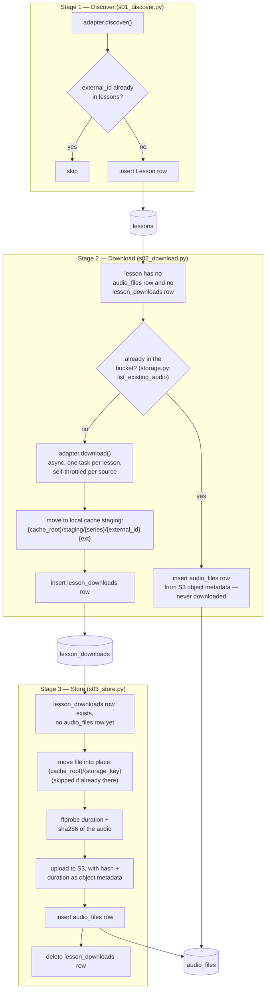

# Discover pipeline

**Status:** Implemented — stages 1-3
**Last updated:** 2026-08-11
**Code:** `src/data_pipelines/pipelines/discover/`

---

## 1. Purpose

Turns a series' adapter into safely-stored audio: candidate lessons at the source →
rows in `lessons` → audio downloaded → audio uploaded to the bucket. This is
`design.md` §2.1's stages 1–3 (Discover, Download, Store) — the start of the
deterministic half of the pipeline. Everything past this point (transcription
onward) is a separate pipeline, not part of this one.

Three independently runnable stages, plus a runner that chains all three across
every series in one process (`run.py`) for periodic/cron use. Each stage is
idempotent on its own — re-running any of them after nothing changed at the source,
or after a prior run was interrupted partway, is safe and just picks up where it
left off. See `database-schema.md` §3.4/§3.4a for the two tables this idempotency is
built on.

---

## 2. Diagram



The dotted-feeling shortcut through the middle — `B1 -->|yes| B2` — is the bucket
recovery path (§4): a lesson can go straight from "just discovered" to "fully
stored" without ever touching stage 3, if its audio already exists in the bucket
from a previous run.

---

## 3. Stage 1 — Discover (`s01_discover.py`)

Calls the series' adapter's `discover()` and inserts a `Lesson` row for every
candidate whose `external_id` isn't already known for that series.

Idempotent via the `(series_id, external_id)` unique constraint on `lessons`
(`database-schema.md` §3.3) — no cursor or checkpoint needed. Re-running after
nothing changed at the source re-derives the same candidates and inserts nothing.

`discover_new_lessons()` already knows every `external_id` the database has for the
series before it calls the adapter at all, so that set — plus the stage's own live
`Progress` display — is passed straight into `adapter.discover(known_external_ids=...,
progress=...)`. Both are hints, not a contract (`SeriesAdapter.discover()`,
`adapters/base.py`): an adapter whose discovery is already cheap in one shot (e.g.
`YouTubePlaylistAdapter`, one `yt-dlp --flat-playlist` call per playlist) can ignore
`known_external_ids` entirely and just yield everything, since the `external_id`
check above still filters it regardless. It exists for the opposite case — a source
where seeing a single candidate costs its own network round-trip (`ElyahuQAAdapter`'s
two-hop discovery, `adapters-plan.md` §1.2) — where skipping that cost for lessons
already known is the difference between a rerun costing one request per lesson in the
archive and costing only the (cheap) listing calls. `progress`, when given, is
somewhere for an adapter to render its own nested task(s) into the stage's existing
display rather than opening a second, competing one — e.g. `ButbulDailyHalachaAdapter`
shows a per-playlist sub-bar (it's the only Butbul series with more than one
playlist), `ElyahuQAAdapter` shows a per-item one.

```bash
uv run python -m data_pipelines.pipelines.discover.s01_discover               # every series
uv run python -m data_pipelines.pipelines.discover.s01_discover <series-slug> # one series
```

---

## 4. Stage 2 — Download (`s02_download.py`)

**"Needs download"** = no `audio_files` row (fully stored) **and** no
`lesson_downloads` row (already downloaded, awaiting store — `database-schema.md`
§3.4a). Both are database rows, not filesystem checks — a download that dies
partway through (network drop, disk full, killed process) can leave a real,
non-empty file sitting at the staging path, and only a row written *after* the file
is fully in place can tell "downloaded" apart from "downloading, or failed midway".

### 4.1 Bucket recovery, before downloading anything

Before queuing a lesson for download, `recover_from_bucket()` checks whether its
audio is already sitting in the bucket — the database can be reset (schema +
catalogue restored from migrations/seed, but discovered lessons and their
`audio_files` rows gone with it) while the bucket, which nothing in this pipeline
ever deletes from, still has everything already uploaded from a prior run.

The check is a prefix search, not an exact key lookup: `storage_key` embeds
`format` (`{rabbi_slug}/{series_slug}/{external_id}.{format}`), but `format` is
only known after a file has been downloaded and probed — a chicken-and-egg problem
for a check that has to happen *before* downloading. Since `external_id` is unique
within a series, listing everything under `{rabbi_slug}/{series_slug}/` and
matching by filename (ignoring the extension) finds the object regardless of what
format it happened to be stored in.

The check is scoped to lessons that actually need one. Reading an object's custom
metadata costs a `HEAD` round-trip per object — the listing itself is cheap, the
metadata is not — so `list_existing_audio()` takes the pending lessons'
`external_id`s and skips every key outside that set, and `recover_from_bucket()`
doesn't hit the bucket at all when nothing is pending. That is the ordinary case on
a re-run: `lessons_needing_download()` has already excluded every lesson with an
`audio_files` row, and re-deriving from the bucket what the database already knows
would cost minutes of serial `HEAD`s for a guaranteed-empty result. The full sweep
happens only in the situation it exists for — a database that lost rows the bucket
still has.

A match is only usable if the object carries `content-hash` and `duration-s` as
custom S3 metadata (attached at upload time by stage 3, §5) — those can't be
recovered any other way without downloading and re-probing the file, which is
exactly what this check exists to avoid. An object missing that metadata (e.g.
uploaded before this convention existed) is silently treated as not found.

A recovered lesson gets its `audio_files` row inserted directly from the object's
metadata (`storage_key`, `format`, `bytes` from the listing; `content_hash`,
`duration_s` from the metadata) — it never enters the download queue, never gets a
`lesson_downloads` row, and the file is **never pulled down to the local cache**.
Local download only happens on demand, later, in the transcription pipeline.

### 4.2 Actually downloading

For lessons that really are new, `adapter.download()` runs — one `asyncio` task per
lesson, with a stage-level `MAX_CONCURRENT` semaphore (`s02_download.py`) capping
how many of those tasks are actually in flight at once. The cap is deliberate and
separate from any adapter's own throttling: every task is scheduled up front, so
without it every lesson would sit "in flight" simultaneously — each showing a live
progress row — while blocked on an adapter's rate limiting underneath, which both
looks like, and is, more downloads running at once than intended. Tune the constant
to change the stage's ceiling.

Below that ceiling, this stage doesn't manage rate limits itself; each adapter is
responsible for throttling its own downloads against its own source's limits
(`YouTubePlaylistAdapter` serializes every download through a shared
`asyncio.Semaphore(1)`, since YouTube's anti-bot limits are per-IP, not
per-playlist or per-series — see `adapters/youtube.py`).

A finished download is moved into a **staging** area — deliberately not the same
directory as the final local cache (§4.3 of `database-schema.md`), since
`storage_key` (and therefore the final cache path) isn't known until stage 3 probes
the file's format:

```
{local_cache_dir}/staging/{series_slug}/{external_id}.{ext}
```

Each `lesson_downloads` row is written as soon as that lesson's download finishes,
in completion order — `download_all()` consumes the tasks through
`asyncio.as_completed` (not `asyncio.gather`) and calls `record_download()` per
outcome. Batching the writes until the whole job list was done would mean a run
interrupted partway through (Ctrl+C, a crash) loses the record of lessons already
downloaded, and the next run re-downloads them.

This is safe with a plain, non-async `Session` even though the downloads themselves
overlap: `asyncio` is cooperative, so the write happens between awaits, never
actually concurrently with another task's code. A lesson that fails to download is
logged and simply left out — it'll show up again next run.

```bash
uv run python -m data_pipelines.pipelines.discover.s02_download               # every series
uv run python -m data_pipelines.pipelines.discover.s02_download <series-slug> # one series
uv run python -m data_pipelines.pipelines.discover.s02_download --lesson-id 42 # one lesson
```

---

## 5. Stage 3 — Store (`s03_store.py`)

**"Needs store"** = has a `lesson_downloads` row and no `audio_files` row yet — the
same completion signal stage 2 writes, read the other way round.

For each pending lesson:

1. Build `storage_key = {rabbi_slug}/{series_slug}/{external_id}.{format}` (format
   taken from the staged file's extension) and move the file from staging into its
   final local-cache position, `{cache_root}/{storage_key}` (`database-schema.md`
   §4.2) — skipped if a file is already sitting at that path (see "Interruption
   safety" below).
2. `ffprobe` the now-in-place file for `duration_s`; `sha256` it for `content_hash`
   (computed on the **extracted, audio-only** file, not the raw platform download —
   the same lesson reposted in a different container/codec should still hash
   differently unless it's genuinely the same bytes).
3. Upload to S3 (`storage.py:upload_to_bucket`), attaching `content_hash` and
   `duration_s` as custom object metadata — this is what makes stage 2's bucket
   recovery (§4.1) possible without re-downloading.
4. Insert the `audio_files` row.
5. Delete the `lesson_downloads` row — its job is done, and the file it pointed at
   is now duplicated at the proper cache path, so there's no reason to keep either
   the staging copy or the row around.

**Interruption safety.** Step 1's move happens before the `audio_files` row is
committed (step 4) — a run interrupted in that window (Ctrl+C, a crash) leaves the
file already relocated to its cache path while the database still shows the lesson as
pending (`lesson_downloads` row present, no `audio_files` row), pointing at a staging
path that no longer has anything at it. Without a check, a retry would crash trying to
move a file that isn't there anymore. `store_lesson_audio()` checks whether the cache
path already exists before attempting the move; if it does, the move is skipped and
the retry just continues from step 2 on the file already in place — the same "safe to
retry no matter where the last run stopped" property stage 2 has for its own
`lesson_downloads` write (§4.2).

```bash
uv run python -m data_pipelines.pipelines.discover.s03_store               # every series
uv run python -m data_pipelines.pipelines.discover.s03_store <series-slug> # one series
```

---

## 6. Running all three together (`run.py`)

Chains stages 1 → 2 → 3 for every series in one process, meant to be invoked
periodically (e.g. a daily cron job):

```bash
uv run python -m data_pipelines.pipelines.discover.run
```

Because every stage is independently idempotent, a run that gets interrupted
partway — some downloads finished but weren't stored yet, say — is harmless. The
next run (whether that's `run.py` again or the individual stages run by hand) just
picks up exactly where the last one left off.

---

## 7. Resetting a series for testing (`reset_series.py`)

Deletes every `Lesson` row for one series — and its dependent `audio_files` /
`lesson_downloads` / `lesson_duplicates` rows, none of which have an `ON DELETE
CASCADE` (see the alembic migrations), so children are deleted before the `lessons`
rows they reference. **Never touches the bucket.**

That last part is the point: with the database rows gone but the bucket untouched,
re-running stage 1 finds nothing and re-inserts every lesson as new, and stage 2 then
hits every one of them through the §4.1 bucket-recovery path instead of downloading —
this is the practical way to exercise `recover_from_bucket()` without waiting for (or
staging) an actual database reset.

```bash
uv run python -m data_pipelines.pipelines.discover.reset_series <series-slug>       # asks for confirmation
uv run python -m data_pipelines.pipelines.discover.reset_series <series-slug> --yes # skips it
```

Unlike the three stages above, the series slug is required rather than optional —
this command is destructive, so an unqualified run must not be able to wipe every
series' lessons at once.

---

## 8. Where things live

| What                         | Where                                                           | Notes                                                                                                                                                                                                   |
| ---------------------------- | --------------------------------------------------------------- | ------------------------------------------------------------------------------------------------------------------------------------------------------------------------------------------------------- |
| Download staging (pre-store) | `{local_cache_dir}/staging/{series_slug}/{external_id}.{ext}` | Pipeline-internal working space, not the schema's official cache. Tracked in`lesson_downloads`, not by filesystem presence.                                                                           |
| Local cache (post-store)     | `{local_cache_dir}/{storage_key}`                             | `database-schema.md` §4.2. No DB existence flag — checked directly on disk. Files may be deleted by hand (manual cleanup, for now); a later transcription-stage read just re-pulls from the bucket. |
| Bucket                       | `s3://{bucket}/{storage_key}`                                 | Same`storage_key` as the local cache, different root. Carries `content-hash`/`duration-s` as object metadata (§4.1, §5).                                                                        |
| `local_cache_dir` config   | `config.toml` → `Settings.local_cache_dir`                 | Defaults to`data/audio-cache`, resolved relative to the repo root if given as a relative path.                                                                                                        |

---

## 9. Related documents

- `documents/design.md` — overall pipeline shape (§2.1) and the deterministic/
  experimental split this pipeline sits inside.
- `documents/database-schema.md` — the tables this pipeline reads and writes:
  `lessons` (§3.3), `lesson_downloads` (§3.4a), `audio_files` (§3.4), and the
  storage-key convention (§4.2).
- `documents/plans/adapters-plan.md` — the adapter interface (`discover()` /
  `download()`) stage 1 and 2 call into.
