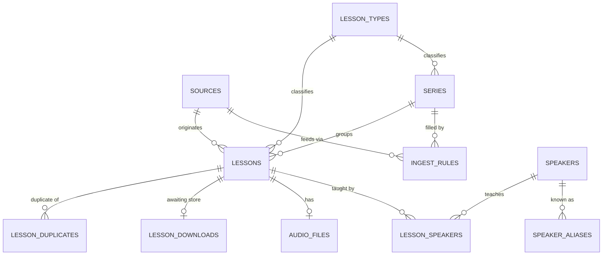

# Plan: catalogue redesign — sources, series, and who actually taught the lesson

**Status:** Proposed redesign — for review. Nothing implemented.
**Survey it depends on:** `documents/pipelines/kolel-channels.md` — every number here comes
from it.
**Changes:** `documents/database-schema.md` §2, §3.1, §3.2, §3.3, §4.1, §4.2, §4.4, §5;
`documents/admin-lab.md` (the catalogue screens, §7.5).

---

## 1. What we now know that the schema doesn't allow

| Fact | Evidence | Current model says |
| --- | --- | --- |
| A lesson can have **two** speakers | `הרב יעקב מדן והרב אמנון בזק` — 289 videos, one lesson each | Impossible — one series, one rabbi |
| A playlist carries **several** speakers | Meir: **32 of 168** playlists genuinely mixed; Har Etzion: 261 of 533 | A series has exactly one rabbi |
| **Not every speaker is a rabbi** | Across the four channels: `ד"ר` ×278, `פרופ'` ×87, `הרבנית` ×69, `פרופסור` ×7, `Dr.` ×22 — e.g. `ד"ר מיכאל אבולעפיה` (95 videos at Meir), `פרופ' יונתן גרוסמן` | The table is called `rabbis` and nothing else fits in it |
| One channel feeds many series; one series draws from many playlists | Hazon Ovadia (5 series, 1 feed); Butbul Daily Halacha (1 series, N yearly playlists) | `adapter_key` is 1:1 with a series; playlist ids are class constants |
| The **same video** can sit in two series | `InDyHd2bKCA` is in both `r-butbul-halichot-olam` and `r-butbul-sichat-hulin` — **downloaded and stored twice, today** | Unique key is `(series_id, external_id)`, so this is legal and invisible |
| A lesson can have **no** identifiable speaker | A small residue after title *and* description are read — §1.1 | Impossible — the rabbi is implied by `series.rabbi_id`, `NOT NULL` |

On the second row, measured rather than assumed: of מכון מאיר's 168 non-empty playlists,
**113 are single-speaker**, 6 are ≥90% one speaker, 17 name nobody, and **32 are genuinely
mixed**. The mixed ones are *thematic anthologies* — `אמונה והשקפה` (104 videos, 18
speakers), `קטעים קצרים לחיזוק "מלחמת חרבות הברזל"` (68, 22) — not lesson series. Every real
series (`ספר הכוזרי`, `מסילת ישרים`, `מורה נבוכים`, `נפש החיים`) is one rabbi teaching one
book. **Both shapes have to be representable.**

### 1.1 Where attribution actually lives

The last row is much weaker than it first looked, and the correction matters because it was
nearly the justification for this whole redesign.

**Attribution is usually present — just not where a first pass looks for it.** Matching an
honorific only at the start of a `|`/`:` segment badly undercounts; matching one *anywhere*
in the title recovers a lot:

| Channel | Videos | Speaker at segment start | Speaker anywhere in title |
| --- | ---: | ---: | ---: |
| כולל חזון עובדיה | 4,650 | 4,507 | **4,529 (97.4%)** |
| אור החיים | 1,374 | 854 | **877 (63.8%)** |
| מכון מאיר | 7,362 | 5,964 | **6,611 (89.8%)** |
| ישיבת הר עציון | 7,966 | 4,059 | **4,771 (59.9%)** |

The gains are forms a narrow matcher misses: `ראש הישיבה הרב משה ליכטנשטיין` (honorific
*before* `הרב` — 327 occurrences), `רה"י הרב` (62), a name after a hyphen rather than a pipe
(`הלכה יומית - שולחן ערוך סימן ל"ב - הרב מרדכי ענתבי`), and non-rabbi honorifics.

**The description carries more still.** In a 50-video sample of each channel's
title-unattributed videos, **Har Etzion 39/50 and Meir 18/50 name a speaker in the
description** — `הדף היומי`, which I earlier described as 892 unattributed lessons, is taught
throughout by **`הרב אודי שוורץ`**, named in every description. This costs no extra API
quota: `get_video_publish_dates()` already requests `part=snippet` and discards everything
but `publishedAt`.

**What genuinely remains** splits in two, and only the first is a lesson at all:

- *Real lessons nobody named* — `יסודות האמונה - שיעור מספר 12 - ברוך שפינוזה`,
  `ספר מסילת ישרים מוקלט - פרק ג'` (a narrated book, with no teacher by nature).
- *Not lessons* — ceremonies (`tekes honoring olim shua solomon`), fundraising
  (`This #Giving Tuesday - Support Yeshivat Har Etzion!`), promos, songs, live-stream
  placeholders (`שיעורי ערוץ מאיר בשידור חי!`).

So `lesson_speakers` is justified by rows 1–3 — co-teaching, mixed playlists, and non-rabbi
speakers — **not** by a large mass of unattributable lessons. That mass does not exist.

## 2. The diagnosis

`series` is doing **three unrelated jobs at once**:

1. **Editorial grouping** — "Daily Halacha", the thing a listener browses.
2. **Attribution** — who taught it.
3. **Source location** — which playlist the bytes come from.

Every anomaly above is one of those three pulling against the others.

- Attribution moves to the **lesson**, where it is a fact — 0, 1, or 2 speakers.
- Source location moves to an explicit **source + rule**.
- The series keeps only its real job: being a group you can browse. **It gets no speaker at
  all** — "who teaches this series" is a question you *ask*, not a field you store (§5).

---

## 3. Authoritative schema



Note what is **absent**: no edge from `SPEAKERS` to `SERIES`.

### 3.0 Naming conventions

- **Speaker slugs are prefixed `r-`**: `r-butbul`, `r-almog-levi`, `r-elbaz`. Applied
  uniformly, including non-rabbis — the prefix is the speaker namespace, not a claim about
  ordination. Existing `rabbi-butbul` / `rabbi-m-eliyahu` / `rabbi-j-ariel` are renamed.
- **Series slugs embed the speaker slug**: `r-butbul-halacha-yomit`, `r-elbaz-selichot`.
- **Names carry their honorific.** `name_he: הרב אהרון בוטבול` / `name_en: Rabbi Aharon
  Butbul`; `ד"ר מיכאל אבולעפיה` / `Dr. Michael Abulafia`. This is why the table can be
  called `speakers` without losing the fact that most of them are rabbis.

### 3.1 Renamed: `rabbis` → `speakers`

Same columns (`id`, `name_he`, `name_en`, `slug`, `created_at`). The rename is the point:
the four channels feature doctors, professors, a `הרבנית`, and lay teachers, and the old
name could not hold them honestly.

### 3.2 New: `speaker_aliases`

Name string → speaker. Two columns, and it absorbs a whole class of bug found by hand.

| Column | Type | Notes |
| --- | --- | --- |
| `name_he` | text | **PK** — one spelling maps to exactly one speaker |
| `speaker_id` | bigint | FK → `speakers.id` |

`אהרן בוטבול` and `אהרון בוטבול` both → `r-butbul`; `אהרן אבוטבול` maps elsewhere or nowhere.
Because the key is the **whole name**, the substring traps (`אבוטבול` ⊃ `בוטבול`,
`לוינשטיין` ⊃ `לוי`) cannot bite. `הרב אודי שורץ` / `הרב אודי שוורץ` is another pair.
Fixing a misattribution is an admin edit, not a code change.

### 3.3 New: `lesson_types`

Replaces the free-string `lesson_type` on `series` and `lessons`.

| Column | Type | Notes |
| --- | --- | --- |
| `id` | bigint | PK |
| `slug` | text | unique |
| `name_he` / `name_en` | text | display |
| `sort_order` | int | so the UI isn't alphabetical-by-accident |

A side table rather than a PG enum: adding a value is a row, not a migration, and the admin
UI can list them. **The vocabulary below is agreed** (2026-09-01).

**The vocabulary is one axis — subject, not format.** The current three values mix three
different axes, which is the real reason the free string drifted: `Q&A` is a format,
`Halacha Lesson` is a subject, `Short Lesson` is a length. Length is already in
`audio_files.duration_s` and needs no type at all.

| slug | `name_he` | `name_en` | What it covers in the surveyed data |
| --- | --- | --- | --- |
| `halacha` | הלכה | Halacha | Butbul Halacha Yomit + Weekly Ashkelon, Hazon Ovadia's four halacha series, Meir `הלכה יומית - אורח חיים`, Har Etzion `עיוני הלכה` |
| `gemara` | גמרא | Talmud | Har Etzion `דף יומי` across ~20 tractates, `שיעור כללי`, `עיון סדר ערב` |
| `tanach` | תנ״ך | Tanach | Meir's Sharki series on בראשית/שמות/ויקרא/במדבר/דברים, Har Etzion `תנ"ך \| ספר מלכים`, `שניים ליום`, `Ramban on the Torah` |
| `parasha` | פרשת שבוע | Weekly Parasha | Or HaChaim `ביאורים על פרשת השבוע`, Har Etzion `פרשת שבוע \| English`, `שיעור לשישי` |
| `mishna` | משנה | Mishna | `פרקי אבות` (two Meir series) |
| `musar` | מוסר | Musar | Or HaChaim `שיעור המוסר השבועי`, Meir `מסילת ישרים`, `חובות הלבבות`, `מידות הראי"ה` |
| `machshava` | מחשבה ואמונה | Jewish Thought | Meir `ספר הכוזרי`, `מורה נבוכים`, `אמונות ודעות`, `לנבוכי הדור`, `אמונה והשקפה` |
| `chasidut` | חסידות | Chasidut | Gluchovsky's `תניא`, Meir `ליקוטי מוהר"ן`, `נפש החיים`, `אורות הנפש` |
| `qa` | שאלות ותשובות | Q&A | Halichot Olam, Sichat Hulin, Eliyahu, Ariel, Meir `שאלות ותשובות` |
| `hadracha` | הדרכה ומשפחה | Guidance & Family | Meir `פסיכותרפיה יהודית` (95), `עוצמה נשית`, `עקרונות הזוגיות`, `הכנה לשידוכים`, `מודעות עצמית` |
| `moed` | מועדים ואירועים | Occasions & Holidays | Or HaChaim `סליחות` + `מעמד התיקון`, Har Etzion `חנוכה`, Meir `ימי בין המצרים`, הילולות, התוועדויות |

`qa` is deliberately a format among subjects — a Q&A show is a genuinely different kind of
content, and splitting it by subject would be both wrong and useless. Noted as the one
exception rather than left as an inconsistency.

**Migration of the three existing values:**

| Old | New | Lessons |
| --- | --- | ---: |
| `Halacha Lesson` | `halacha` | 205 |
| `Short Lesson` | `halacha` — length lives in `duration_s` | 1,398 |
| `Q&A` | `qa` | 606 |

**Known gap:** biography/history (`אישי ישראל`, 60 items) has no home. Too small to justify a
type yet; it will land under `machshava` or want its own row later.

### 3.4 New: `sources`

Somewhere we poll. One row per channel or site.

| Column | Type | Notes |
| --- | --- | --- |
| `id` | bigint | PK |
| `slug` | text | unique |
| `name` | text | display |
| `platform` | text | `youtube` \| `http` — selects download mechanics |
| `external_id` | text | channel id, site root, Spreaker show id |
| `parser_key` | text | which title parser this source needs (§4.2) |

The existing six series come from **four** sources, not one — worth noticing, because it is
what makes the `(source_id, external_id)` key correct:

| slug | external_id | serves |
| --- | --- | --- |
| `butbul-radio` | `UCYG1zMLW7s7QTwalxKOLmzw` | Halichot Olam, Sichat Hulin |
| `butbul-main` | `UCS9moGQA0U4MqWzT98mIlGw` | Weekly Ashkelon, Daily Halacha |
| `harav-org` | harav.org | Eliyahu Q&A |
| `spreaker-ariel` | Spreaker show id | Ariel Q&A |

Sources also own rate limiting (today a module-level semaphore in `youtube.py`) and are the
unit `prediscover` surveys.

### 3.5 New: `ingest_rules`

How a series gets filled. A series may have several; a source serves many.

| Column | Type | Notes |
| --- | --- | --- |
| `id` | bigint | PK |
| `source_id` | bigint | FK → `sources.id` |
| `series_id` | bigint | FK → `series.id` |
| `kind` | text | below |
| `config` | jsonb | validated by a per-`kind` Pydantic model |
| `default_speaker_id` | bigint NULL | FK → `speakers.id` — see §4.3 |
| `priority` | int | lower wins when two rules claim the same video |
| `enabled` | bool | default true |

| `kind` | config | covers |
| --- | --- | --- |
| `youtube_playlist` | `{playlist_id}` | Halichot Olam, Sichat Hulin, Weekly Ashkelon, every Meir series |
| `youtube_playlist_prefix` | `{title_prefix}` | Butbul Daily Halacha's one-playlist-per-Hebrew-year |
| `title_match` | `{speakers: [<slug>], topic?}` | Hazon Ovadia's five series, Or HaChaim's four |
| `whole_feed` | `{}` | Eliyahu (harav.org), Ariel (Spreaker) |

Every `config` also accepts an optional **`exclude: [pattern, ...]`** — see §4.4.

**All six existing series fit these four kinds** — the test that this abstraction was derived
from the problem rather than invented for the new channels.

Note `title_match.speakers` holds **speaker slugs, not name strings**. Spelling variants are
`speaker_aliases`' job, so a rule never repeats them.

### 3.6 New: `lesson_speakers`

The factual attribution. Zero rows = nobody identified. Two rows = co-taught.

| Column | Type | Notes |
| --- | --- | --- |
| `lesson_id` | bigint | FK, PK part |
| `speaker_id` | bigint | FK, PK part |
| `position` | int | 1, 2 — display order |

### 3.7 Changed: `series`

- **`rabbi_id` is dropped.** Not nullable — gone. A series' speakers are derived (§5).
- **`adapter_key` is dropped.** Its jobs split into `sources.platform` (download),
  `sources.parser_key` (parsing), and `ingest_rules` (location).
- `lesson_type` → `lesson_type_id`.

### 3.8 Changed: `lessons`

- Gains `source_id` (FK, not null).
- Gains **`speaker_raw`** (text, nullable) — the speaker string exactly as the title or
  description gave it, kept even after resolution. This makes alias curation retroactive:
  add an alias, re-run resolution, and previously-unattributed lessons gain speakers
  **without re-scraping**. It is also the admin queue's input (§6).
- Unique constraint moves from `(series_id, external_id)` to **`(source_id, external_id)`** —
  one video is one lesson however many rules claim it, so it downloads and transcribes once.
  This is not hypothetical: `InDyHd2bKCA` is stored twice today.
- `lesson_type` → `lesson_type_id` (nullable).
- `series_id` stays not null: one series per lesson, chosen by rule `priority` (§8).

---

## 4. Discovery flow

### 4.1 The loop

```
for each enabled source:
    listing_cache = {}                        # shared across this source's rules
    for each enabled ingest_rule (by priority):
        for entry in rule.list(listing_cache):
            candidate = parser(source.parser_key).parse(entry)
            lesson = upsert(source_id, external_id)     # idempotent, one row per video
            attach lesson -> rule.series_id             # first rule by priority wins
            resolve_speakers(lesson, candidate, rule)
```

One listing per source per run, not per series. Idempotency is unchanged in character —
still a unique constraint, still no cursor; only its columns change.

### 4.2 What stays code

`database-schema.md` §4.1 argued series-level filtering is "closer to arbitrary code than to
a declarative filter" — **and that still holds, for parsing.** Extracting an occasion from a
Butbul title, or a Hebrew date, is code. What §4.1 also predicted is now due: *"moving source
locations into a database table becomes worth its complexity"* once patterns repeat. Meir's
~100 playlists is that moment.

**Locations become data; parsing stays code**, one parser per source.

### 4.3 Resolving speakers

Four paths, in order:

1. **The title names someone** → `speaker_raw` is set; look it up in `speaker_aliases`.
   Hit → a `lesson_speakers` row. Miss → no row, and the string surfaces in the admin queue.
   The honorific must be matched **anywhere in the title, not only at a segment start**, and
   the vocabulary is wider than `הרב`: `ראש הישיבה הרב`, `רה"י הרב`, `הגאון הרב`, `הרה"ג`,
   `הרבנית`, `פרופ'`, `פרופסור`, `ד"ר`, `Rav`, `Rabbi`, `Prof.`, `Dr.` — worth ~1,400 extra
   attributions across the four channels (§1.1).
2. **The rule knows** → `ingest_rules.default_speaker_id`. The normal case for a curated
   playlist: `ספר הכוזרי לריה"ל | הרב אורי שרקי` needs no parsing, because accepting that
   playlist *was* the attribution decision.
3. **The description names someone** → same alias lookup. **This costs nothing** — the
   description is already fetched and discarded today. Noisier than title parsing, so it
   ranks below the rule's own answer.
4. **None of the above** → zero speaker rows; the lesson is still ingested (§11, decision 1).

For `title_match` rules the same lookup does the **routing**: parse → `speaker_raw` →
alias → speaker → the rule naming that speaker slug claims the lesson. One mechanism, not two.

### 4.4 Excluding non-lessons

Not everything a channel uploads is a lesson. Timetables (`לוז עצמאות תשפו`), ceremonies
(`tekes honoring olim yoni adler`), fundraising appeals
(`This #Giving Tuesday - Support Yeshivat Har Etzion!`), promos, songs and live-stream
placeholders (`שיעורי ערוץ מאיר בשידור חי!`) are **skipped, not ingested unattributed**.

Two layers, because the two kinds of exclusion have different lifetimes:

1. **Per-source defaults, in the parser** (code). Each source's boilerplate is stable and
   belongs with its parser — Hazon Ovadia's `לו"ז`, `לוח שיעורים`, `שיעורים - <holiday>`;
   Meir's `שידור חי`; Har Etzion's `tekes`, `Giving Tuesday`, `Ceremony honoring`.
   These account for nearly all of Hazon Ovadia's 138 unparseable titles.
2. **Per-rule `exclude` patterns**, in `ingest_rules.config` (data). For the one-off a
   curator spots after the fact, fixable without a deploy.

A skipped entry is **counted and reported**, never silently dropped — an exclusion pattern
that quietly eats 400 real lessons is exactly the failure this design is trying to avoid.
No general heuristic is attempted: "is this a lesson" is not reliably decidable from a title,
and a wrong guess costs more than a curator's five minutes.

---

## 5. Derived data

**Rule: derived data is not stored, except as an optimisation — and when it is stored, it
lives in its own obviously-rebuildable object, never as a column on an authoritative table.**

"Who speaks in this series" is the first instance. It is a **view**:

```sql
CREATE VIEW series_speakers AS
SELECT l.series_id, ls.speaker_id, count(*) AS lesson_count
FROM lessons l
JOIN lesson_speakers ls ON ls.lesson_id = l.id
GROUP BY l.series_id, ls.speaker_id;
```

Zero storage, cannot drift. Speaker → series browsing goes through it, and so does the
"this series is by X" label the UI wants — `series_speakers` ordered by `lesson_count`.

If it ever gets slow:

- **Set-valued aggregates** become a **materialised view**, refreshed at the end of
  discovery. Still obviously derived; its definition *is* the recreation recipe.
- **Scalar per-entity fields** (lesson counts, total duration, first/last lesson date) go in
  a **1:1 sidecar table** — `series_stats(series_id PK, ...)`, `speaker_stats(speaker_id PK, ...)`.
  Never a column on `series` or `speakers`.

**Nothing is built now.** The view is enough at this scale; this section says where the
pressure valve is.

---

## 6. Admin flow

1. **Sources** — add a channel by URL; platform and external id resolved automatically.
2. **Survey** (`prediscover`) — playlists with item counts, speaker census, playlist
   coverage, orphan count.
3. **Accept** — tick the playlists you want. Each becomes a `series` + an `ingest_rule`, with
   the name and `default_speaker_id` pre-filled from the playlist title for you to correct.
   This is the review gate that replaces hand-writing 100 YAML entries.
4. **Unknown speakers queue** — distinct `speaker_raw` values with no alias, by frequency.
   Map each to an existing speaker, a new one, or "ignore". Resolution then re-runs over the
   affected lessons; no re-scrape, because `speaker_raw` was kept.
5. **Discover** runs per source on a schedule.

**A series always starts empty** — created at "accept", populated at the next discovery run.
Every screen and the `series_speakers` view must tolerate zero rows.

### 6.1 Catalogue files: deltas in, full file out

`catalogue.yaml` **reshapes**: series are no longer nested under rabbis, because they no
longer belong to one. It becomes six flat lists — `speakers`, `speaker_aliases`,
`lesson_types`, `sources`, `series`, `ingest_rules`.

One hand-edited file stops working once curation is continuous — accepting Meir's playlists
a few at a time would mean repeatedly hand-merging into a file of hundreds of entries. So
the file splits by role:

| Path | Role | Written by |
| --- | --- | --- |
| `seed_data/catalogue.yaml` | The **complete, authoritative** catalogue | `export_catalogue.py` — generated, not hand-edited |
| `seed_data/additions/<date>-<what>.yaml` | A **delta** — only what is being added | You, or `prediscover`'s accept flow |

The workflow is **seed a delta, then export the whole thing**:

```
uv run python -m data_pipelines.catalogue.seed_catalogue \
    --input seed_data/additions/2026-09-14-meir-sharki.yaml
uv run python -m data_pipelines.catalogue.export_catalogue      # rewrites catalogue.yaml
```

One commit then shows both the delta that was applied and the resulting diff to the full
file — the delta says *what you decided*, the full file says *what is now true*.

`seed_catalogue.py` already supports this: it upserts by slug and **never deletes**, so a
file containing only new rows leaves everything else untouched. Three small changes are
needed:

- Every top-level list in `CatalogueSeed` defaults to empty, so a delta naming only `series`
  and `ingest_rules` validates.
- References are checked before writing — a delta whose `ingest_rule` names a speaker slug
  that exists in neither the file nor the database fails loudly rather than half-applying.
- `export_catalogue.py` sorts deterministically (by slug, everywhere), so the full file's
  diff shows only what actually changed. Without this the review value evaporates.

**Deltas are kept, as a curation record, not as a replay log.** Seeding a fresh database uses
`catalogue.yaml` alone; nobody should ever replay the `additions/` directory in order. Their
value is answering "when and why did this series arrive", which matters once a hundred of
them have.

`export_catalogue.py` must be updated in the same commit as each schema change, or the first
export after it silently drops the new fields.

---

## 7. The channels this is for

**Import is selective by design.** `ingest_rules.enabled` is per-rule, and nothing is
ingested until a rule exists. Land the schema, confirm the existing six series rebuild
identically, then review the surveyed channels and enable series one at a time. Nothing
below is a commitment to import all of it.

### 7.1 כולל חזון עובדיה — `title_match` rules

One source, one uploads listing, five rules. Routing is by resolved speaker (§4.3), so
spelling variants live in `speaker_aliases`, not in the rule.

| Speaker | Status | Series slug | Videos | `config` |
| --- | --- | --- | ---: | --- |
| הרב אהרון בוטבול | **existing** `r-butbul` | `r-butbul-hazon-ovadia` | 392 | `speakers: [r-butbul]` |
| הרב אלמוג לוי | new `r-almog-levi` | `r-almog-levi-hazon-ovadia` | 421 | `speakers: [r-almog-levi]` |
| הרב בנימין חותה | new `r-binyamin-chota` | `r-binyamin-chota-hazon-ovadia` | 422 | `speakers: [r-binyamin-chota]` |
| הרב יעקב סיני | new `r-yaakov-sinai` | `r-yaakov-sinai-hazon-ovadia` | 131 | `speakers: [r-yaakov-sinai]` |
| הרב יחיאל גלוכובסקי | new `r-gluchovsky` | `r-gluchovsky-tanya` | 320 | `speakers: [r-gluchovsky], topic: תניא` |

Aliases needed: `אהרן בוטבול` and `אהרון בוטבול` → `r-butbul`.

Parser (`parser_key: hazon_ovadia`), per entry: strip bidi characters and collapse
whitespace; match a leading honorific; everything up to the first `:` is the speaker (with no
colon, the first two words, extending past a connector `בן`/`בר`/`הלוי`); the remainder is
the topic. `title_he` = topic (raw title if empty), `description_he` = raw title,
`speaker_raw` = the extracted speaker, `recorded_at` = `published_at` — no title on this
channel carries a date.

### 7.2 אור החיים — `title_match` rules

| Speaker | Series slug | Videos |
| --- | --- | ---: |
| הרב ראובן אלבז (new `r-elbaz`) | `r-elbaz-musar-weekly` | 282 |
| " | `r-elbaz-selichot` | 187 |
| " | `r-elbaz-tikun` | 48 |
| " | `r-elbaz-biurim-parasha` | 130 |

Parser (`parser_key: or_hachaim`): split on ` - ` **and** ` – ` — the separator is both ASCII
hyphen and en-dash, mixed within one channel. First segment is the speaker, second the
series, third a Hebrew date. Unlike Hazon Ovadia, `hebrew_date.py` applies and `recorded_at`
can be real.

`ביאורים על פרשת השבוע` names no speaker *in the title*, but every description reads
`מאת מרן ראש הישיבה הגאון הרב ראובן אלבז` — so its rule needs `default_speaker_id`, since
the title alone can never say so.

### 7.3 מכון מאיר — `youtube_playlist` rules, no new code

102 rabbi-named playlists are directly usable. Each accepted playlist becomes a `series` plus
one rule with `default_speaker_id` from the playlist title — **no parser, no adapter class,
nothing but rows.** The 32 anthology playlists work too: their lessons carry different
speakers and `series_speakers` returns many rows.

Its 3,583 orphan videos are a title-routed second pass over a playlist-routed channel — not
this plan.

### 7.4 ישיבת הר עציון — unblocked, not scheduled

Previously deferred because the schema could not express series with no speaker, series with
25, or co-taught lessons. **The redesign removes that blocker.** What remains is curation —
which of 561 playlists (median 8 items) are worth having. No rules proposed here.

---

### 7.5 The admin website

**The migration breaks the admin lab, and this is not optional work.** Measured:

| Layer | What breaks |
| --- | --- |
| `admin_lab_api/schemas/catalogue.py` | `RabbiWrite`/`RabbiRead` (renamed entity); `SeriesWrite`/`SeriesRead` carry `rabbi_id`, `rabbi_name_en`, `lesson_type`, `adapter_key` — **all four fields are removed or replaced** |
| `admin_lab_api/routers/catalogue.py` | `/api/rabbis` CRUD ×4 and `/api/series` CRUD, all referencing the `Rabbi` model |
| `frontend/src/pages/RabbisPage.tsx` | 31 references — the whole page |
| `frontend/src/pages/SeriesPage.tsx` | 25 — list columns and the create/edit form |
| `frontend/src/pages/LessonPickerPage.tsx` | 21 — filters by rabbi |
| `frontend/src/api/catalogue.ts` | 10 |
| `SeriesDetailPage`, `JobRunPage`, `Header`, `api/lab.ts` | 6 combined |
| `frontend/src/api/schema.d.ts` | 41 — **regenerates**, `npm run gen:api` |

Types regenerate from OpenAPI; the pages consuming them do not.

### What changes, and what should be rethought rather than ported

**Straight ports:**

- Rabbis page → **Speakers** page. Same CRUD, new name, `r-` slugs, plus `speaker_aliases`
  editing — which is what makes the unknown-speakers queue (§6) actionable.
- Series form: drop `rabbi_id` and `adapter_key`; `lesson_type` becomes a select over
  `lesson_types`.
- Series list: the `rabbi_name_en` column is now **derived** — read `series_speakers` and
  show the top speaker by `lesson_count`, or "N speakers" for an anthology, or nothing for a
  series with no lessons yet. It can no longer be a single joined field.

**Do not port:** the "create a series by filling in `adapter_key`" form. Under §6 a series is
created by accepting a surveyed playlist, which fills in name, source, rule and
`default_speaker_id` together. Rebuilding the old form first and replacing it later is wasted
work.

**New surfaces**, in the order they earn their keep: sources list → survey/accept → unknown-speakers
queue → per-series ingest rules.

### Sequencing note

The lab's own job history is truncated in migration step 5 and lesson ids change, so
`JobRunPage` and `LessonPickerPage` will show an empty lab afterwards. That is expected —
`lab_jobs` is disposable by your call — but it means **the admin work should land after
step 6 verification, not during it.** The pipeline must be provably correct before the UI
that inspects it is also in flux.

---

## 8. Deliberately deferred

- **`series_lessons` (many-to-many lesson↔series).** Real — 351 Meir videos and 2,031 Har
  Etzion ones sit in more than one playlist, and `InDyHd2bKCA` already does in our own data.
  Deferred because `priority` makes the choice deterministic and the join table is additive.
- **Anthology playlists as first-class objects.** Representable as-is; nothing special needed.
- **Playlists with rotating speakers** (`חידוש מהגוש`, 25 speakers) — representable, not ingested.

---

## 9. Storage keys

`storage_key_prefix()` (`storage.py:34`) builds `{series.rabbi.slug}/{series.slug}/{external_id}`
— **it dereferences the field we are removing.** `list_existing_audio()` also lists the bucket
by that prefix to recover after a database reset, so both writing and recovery break.

New convention: **`{series_slug}/{external_id}.{ext}`**. Series slugs are globally unique, so
the speaker component was decorative. Deriving it from a speaker is not an option — a lesson
may have none.

This is executed by a **one-time migration script** (§10, step 3), not by carrying two
conventions in `list_existing_audio` forever.

---

## 10. Migration: rebuild, don't transform

The catalogue is small, hand-curated, and version-controlled. Everything below it —
2,209 lessons, 2,207 audio files — is **machine-derived and reproducible**. Verified:

| | |
| --- | --- |
| `lesson_duplicates` rows | **0** |
| Lessons with hand-entered `title_en` / `description_en` | **0** |
| Pending `lesson_downloads` | **0** |
| YouTube videos since deleted or privatised | **0 of 2,059** — all still resolve |
| `lab` schema | one table, `lab_jobs`, 35 rows, FK → `public.lessons`; disposable by your call |

So there is nothing to preserve by backfilling. **Drop the derived data, reseed the
catalogue, and re-run discover.** That removes every backfill migration from this plan and
replaces them with one S3 script.

The pipeline already supports this: `recover_from_bucket()` (`s02_download.py`) checks the
bucket before downloading and writes `audio_files` rows straight from object metadata. A
rebuild therefore costs **zero downloads** — it re-derives rows around audio that never moves.

### Steps

Order matters in two places: the new storage keys are built from **series slugs**, so the
catalogue must be settled before anything is copied; and the re-key needs the **old
`audio_files` rows** to know what to copy from, so it must run before they are wiped.

1. **Snapshot first.** `pg_dump -n public` (which `design.md` §7.3 specifies and nothing
   implements yet), plus a plain export of `lessons` to YAML. Cheap, and it is the only thing
   standing between a mistake and re-downloading 39 GB.
2. **Schema.** One Alembic migration, free to be destructive: create `speakers`,
   `speaker_aliases`, `lesson_types`, `sources`, `ingest_rules`, `lesson_speakers`; alter
   `series` and `lessons` (§3.7, §3.8); create the `series_speakers` view; drop `rabbis`.
3. **Write the new `catalogue.yaml`** — six flat lists covering the four existing sources,
   the six existing series and their rules, the speakers, aliases and lesson types.
   **Slugs are final at the end of this step**, which is why it precedes the re-key.
4. **S3 re-key** (one-time script, §9), driven by the settled catalogue rather than a
   hardcoded rule: for each existing `audio_files` row, map its old key to
   `{new_series_slug}/{external_id}.{ext}` and **server-side copy** it. Verify every object
   landed — byte size and content hash against the row — but **delete nothing yet** (step 7).
   Move the local cache the same way. **Report and skip the known duplicate**: `InDyHd2bKCA`
   has two objects and will have one lesson; copy the `halichot-olam` one.
5. **Wipe derived data and seed.** `TRUNCATE lab.lab_jobs`, then `lessons`, `audio_files`,
   `lesson_downloads` (cascading). Seed the catalogue from step 3.
6. **Re-run discover** for the six existing series: `s01` re-creates lessons, `s02` finds
   every file already in the bucket and writes `audio_files` rows **without downloading**,
   `s03` has nothing to do.
7. **Verify, then clean up.** Only once the criteria below pass, delete the old-key S3
   objects. Until that deletion the migration is fully reversible: the bucket still holds
   every original object and step 1 still holds the row that named it.
8. **Admin website** (§7.5) — after verification, not during. The API and pages break on
   step 2's schema change, so the lab is down between steps 2 and 8; that is acceptable for a
   single-operator tool but should be a deliberate choice, not a surprise.
9. **Then** build the new parsers and channels (§7.1–§7.4).

### Acceptance criteria for step 6

- **2,208 lessons** — the previous 2,209 less the collapsed duplicate.
- **2,206 `audio_files` rows**, and **zero bytes downloaded**. Any download at all means the
  re-key or the key convention is wrong; stop and fix rather than let it re-fetch 39 GB.
- Per-series counts match the pre-migration snapshot exactly, except `sichat-hulin` at −1.
- Every lesson has ≥1 `lesson_speakers` row (all six existing series are single-speaker).
- One orphaned S3 object, reported by step 3.

### The one risk worth naming

The 150 non-YouTube lessons (Eliyahu 137, Ariel 13) are re-discovered by re-scraping
harav.org and Spreaker. If either site has changed what it lists, some lessons will not come
back and their audio is orphaned in the bucket. This is exactly what step 1's snapshot is
for — compare counts after step 6 and re-attach by hand if needed. The YouTube side carries
no such risk: all 2,059 videos still resolve.

---

## 11. Open decisions for you

**None blocking.** The remaining judgement calls are all deferred to catalogue review:

- **Invented names and transliterations** — `בנימין חותה` (the channel spells it with ת in
  all 421 titles; if `name_he` should use ט, the *matcher* still needs ת) ·
  `Rabbi Almog Levi` · `Rabbi Binyamin Chota` · `Rabbi Yaakov Sinai` ·
  `Rabbi Yechiel Gluchovsky` · `Rabbi Reuven Elbaz` · the four Hazon Ovadia halacha series'
  `name_he`/`name_en`. **You will vet these when reviewing the generated `catalogue.yaml`**,
  which is the right place — they are data, not design.

## 12. Resolved (was open)

- **`rabbis` → `speakers`**, names carrying their honorific, slugs prefixed `r-`. §3.0, §3.1.
- **`lesson_type` becomes a side table** with a fixed subject vocabulary, not a free
  string. §3.3.
- **A series may have no lessons** — it always starts that way. §6.
- **Non-lessons are excluded, not ingested unattributed.** §4.4.
- **The `lesson_types` vocabulary is agreed** — the eleven rows in §3.3.
- **Migration is a rebuild, not a transform.** §10.
