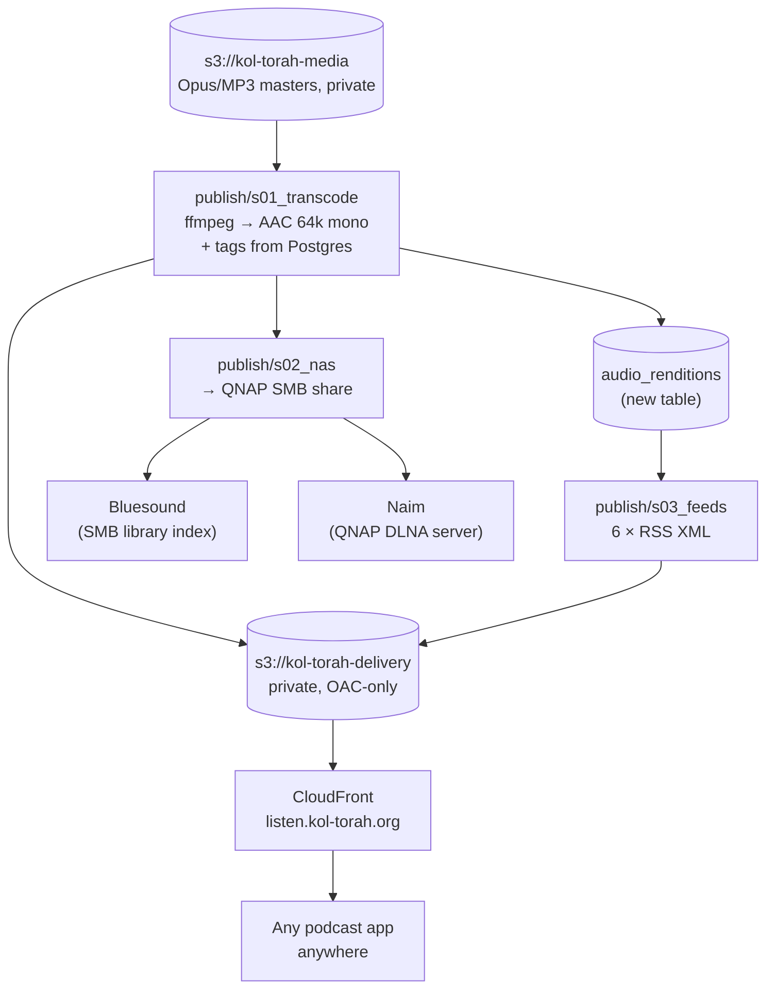

# Plan: personal playback — listen to the archive on a phone anywhere, and on the house streamers

**Status:** Planned — not yet implemented.
**Code to touch:** new `src/data_pipelines/pipelines/publish/` (`s01_transcode.py`,
`s02_nas.py`, `s03_feeds.py`, `run.py`); one Alembic migration
(`audio_renditions`); touches `config.toml`, `src/data_pipelines/config.py`,
`documents/database-schema.md`. New sibling repo `infra/` (OpenTofu), added to
`kol-torah.code-workspace`.

The archive is 2,207 files, **39.4 GB, ~1,000 hours**, organised by rabbi → series →
date, and none of it is listenable without SSH access to this machine. This plan makes it
playable in two places: **any podcast app, anywhere** (S3 + CloudFront behind an
unguessable URL), and **the Bluesound and Naim at home** (tagged AAC on the QNAP).

Both are downstream of one shared artefact — an AAC delivery rendition — which is the
only reason this is one plan and not two.

**This is personal playback, not the public web tier.** The React Router + Django site in
`../documentation/design/web-architecture.md` is a separate, later thing. Nothing here
should grow into it: no accounts, no player UI, no API. Static files and a podcast app.

---

## 0. Decisions made for this plan

| Question | Decision |
| --- | --- |
| YouTube playlists as the phone route | **Dropped.** It needed OAuth + a 7-day-refresh-token trap, returned YouTube's raw titles instead of our parsed ones, and *structurally cannot* serve Eliyahu (harav.org) or Ariel (Spreaker), which are not on YouTube at all. |
| Delivery format | **AAC-LC, 64 kbps mono, `.m4a`.** Naim does not support Opus (§3.1) and neither do most podcast apps, so the 93%-Opus archive is undeliverable as-is. One AAC rendition serves phone, Bluesound and Naim. |
| Opus masters | **Kept, untouched.** AAC is a derived rendition, not a replacement — transcription reads the masters. |
| Second S3 bucket | **Yes — `kol-torah-delivery`, separate from `kol-torah-media`.** Reasons in §4.1. The short version: the archive bucket keeps Block Public Access fully on and never appears in a CloudFront policy. |
| Secret in the hostname (`<hash>.kol-torah.org`) | **No — secret goes in the path.** A per-name ACM cert publishes the hostname to public Certificate Transparency logs, which are indexed and searchable (crt.sh). The "unguessable" subdomain would be published the moment the cert issued. See §4.3. |
| Hostname | **`listen.kol-torah.org`** — deliberately boring. Secrecy lives in `/<32-hex>/`, which is never logged publicly. |
| Bucket exposure | **Private bucket + CloudFront OAC.** No public-read bucket policy anywhere; only the distribution can read the origin. |
| IaC tool | **OpenTofu**, not Terraform. Same HCL, same providers, MPL 2.0 instead of BUSL, native S3 state locking. §5.1. |
| IaC location | **New sibling repo `infra/`**, matching the existing `data-pipelines` / `web` / `shared` / `documentation` split. The web tier will need infra too; it should not live inside the pipeline repo. |
| Existing bucket | **Imported into OpenTofu** via `import` blocks, not left unmanaged. Adopting it must be a zero-change plan (§5.4). |
| Cloud portability | **Not delivered by the IaC tool** — see §5.5 for what actually buys it. Stated honestly rather than assumed. |
| Feed scope | **All six series, full archive**, not a rolling window. Podcast apps download only what you tap, so a long feed costs nothing; the 8-week window was a YouTube-playlist constraint that no longer applies. |
| Auth on the feed | **None beyond the unguessable path.** Treated as *unlisted, not secured*. Signed URLs are wrong here — podcast apps download hours or days later, and signed URLs expire. |

---

## 1. Shape



Three stages, one shared transcode. Each independently idempotent and re-runnable, same
contract as the discover pipeline's stages.

---

## 2. Stage 1 — the AAC rendition (`publish/s01_transcode.py`)

For every `audio_files` row without a rendition: pull the master (local cache or bucket),
`ffmpeg` to 64 kbps mono AAC-LC, write tags, record the result.

**Tags are not cosmetic.** The BluOS library index and the DLNA browse tree are both built
entirely from tags — untagged files present as 2,207 anonymous rows in both apps.

| Tag | Source |
| --- | --- |
| `artist` / `albumartist` | `rabbis.name_he` |
| `album` | `series.name_he`, **split by Hebrew year for Halacha Yomit** |
| `title` | `lessons.title_he` (the parsed occasion/topic, not the raw YouTube title) |
| `date` | `coalesce(lessons.recorded_at, lessons.published_at)` |
| `tracknumber` | position within the album, by date |
| `comment` | `lessons.description_he` |

Halacha Yomit is split by Hebrew year because 1,398 tracks in one `album` is unusable in
both the BluOS and Naim apps. The source playlists are already per-year
(`הלכה יומית תשפ"ו` …), so the boundary already exists.

Use `coalesce(recorded_at, published_at)`, not `recorded_at` alone — measured: Weekly
Ashkelon has **32** lessons where Hebrew-date parsing found nothing, Halacha Yomit has 8.
Without the fallback those sort to the bottom and appear undated in every client.

### 2.1 New table: `audio_renditions`

Presence in the delivery bucket must not be how we know a file is transcoded — exactly the
argument that produced `lesson_downloads` (`database-schema.md` §3.4a): a job killed
partway leaves a real, non-empty file that is not a finished rendition. A row written
after the file is fully in place is the only thing that can tell those apart.

| Column | Type | Notes |
| --- | --- | --- |
| `id` | bigint | PK |
| `audio_file_id` | bigint | FK → `audio_files.id`, not null |
| `kind` | text | `"delivery-aac"` — leaves room for a second profile later |
| `storage_key` | text | key in the **delivery** bucket |
| `format` | text | `m4a` |
| `bitrate_kbps` | int | 64 |
| `bytes` | bigint | |
| `content_hash` | text | sha256, same convention as `audio_files` |
| `created_at` | timestamptz | default now() |

Unique on `(audio_file_id, kind)`.

**Cost:** ~28 GB and well under an hour of ffmpeg parallelised on the GB10.

---

## 3. Stage 2 — the house streamers (`publish/s02_nas.py`)

Publish the tagged AAC to the QNAP as `/<Rabbi>/<Series>/<YYYY-MM-DD> <title>.m4a`.
The QNAP covers both boxes with no extra software:

- **Bluesound** → **SMB share**, added in the BluOS app as a Music Library. BluOS has *no*
  UPnP/DLNA support at all — deliberately, they index SMB into their own database — so
  SMB is the only native route.
- **Naim** → QNAP's built-in **DLNA Media Server** (Control Panel → Applications; QTS
  auto-installs the Media Streaming Add-on on first enable).

Requires SMB ≥ 2.1 on the share; BluOS dropped SMB 1.0 in 2020.

### 3.1 Why not just point them at the Opus masters

Bluesound plays Opus fine. **Naim does not** — its supported list is
WAV / FLAC / AIFF / ALAC / MP3 / AAC / Ogg Vorbis / WMA / DSD, with Opus absent. One AAC
tree serves both; two trees would be pointless duplication.

### 3.2 If Naim's browse tree disappoints

Install **MinimServer** as a QNAP QPKG. QNAP's built-in DLNA server is adequate but
mediocre at tag handling, and MinimServer is what the Naim community actually runs. Start
built-in; switch only if it annoys.

---

## 4. Stage 3 — the phone, anywhere (`publish/s03_feeds.py` + infra)

Six RSS XML files, one per series, written to the delivery bucket. Each `<item>` carries
title, description, `pubDate`, `itunes:duration`, a GUID (the lesson's `external_id`), and
an `<enclosure>` URL pointing at the AAC.

There is **no server**. The system is static files in a bucket behind a CDN; the podcast
app does all playback work. Subscribing is *Add a Show by URL* — supported in Apple
Podcasts, Overcast, Pocket Casts, AntennaPod and Castro alike. After that it behaves like
any podcast: background play, lock screen, CarPlay/Android Auto, offline download, speed
control, resume position — none of which we build, and none of which needs a subscription.

Feeds need cover art per series or they look broken in every client. Six images, one-time.

### 4.1 Why a second bucket

| Reason | |
| --- | --- |
| **Blast radius** | `kol-torah-media` holds masters that cost ~1,000 hours of downloading to assemble. `kol-torah-delivery` holds only regenerable derivatives. A policy mistake on the latter exposes AAC copies; the same mistake on a shared bucket exposes everything. |
| **Block Public Access** | The archive bucket keeps BPA fully on and never names a CloudFront principal in its policy. That property is only auditable if the buckets are separate. |
| **Lifecycle** | Masters want Glacier tiering for old material and must never expire. Renditions are disposable and can be deleted and regenerated at will. Opposite rules, and lifecycle config is per-bucket. |
| **Cost attribution** | CDN egress lands on its own line rather than mixed into pipeline traffic. |
| **Clean teardown** | `tofu destroy` on the delivery module cannot reach the archive. |

Adds `s3_delivery_bucket_name` to `config.toml` and `Settings`.

### 4.2 CloudFront

| Setting | Value | Why |
| --- | --- | --- |
| Origin access | **OAC** (Origin Access Control) | Bucket stays fully private; OAI is legacy. |
| Viewer protocol | redirect-to-https | |
| Methods | GET, HEAD | Nothing writes. |
| Behaviour: `*.xml` | short TTL (~5 min), compress | New episodes appear promptly with no invalidation logic to maintain. |
| Behaviour: default (audio) | long TTL, no compress | An `.m4a` never changes once written; AAC does not compress further. |
| Price class | **PriceClass_200** | `PriceClass_100` is US/Canada/Europe only and excludes the Tel Aviv edge. |
| Access logging | off initially | Costs money, answers no question we currently have. |

The ACM certificate must be in **us-east-1** — a hard CloudFront requirement. Convenient
here: `kol-torah-media` is already in us-east-1, so no second provider alias is needed.

### 4.3 The secrecy model, and why the hostname is boring

The plan was `<random-hash>.kol-torah.org`. **That does not work.** Every publicly-trusted
certificate is published to append-only Certificate Transparency logs, browser policy
makes CT non-optional, and those logs are indexed and searchable through crt.sh. AWS's own
ACM guidance says it outright: do not put confidential information in public certificate
domain names. Requesting a cert for the secret subdomain publishes the secret.

So:

```
https://listen.kol-torah.org/9f3a2c8b1e4d7a60/halacha-yomit.xml
                └── boring, in the cert ──┘└── secret, never logged ──┘
```

A wildcard `*.kol-torah.org` cert would also avoid the leak and would let the hash stay in
the hostname. It is the worse option: wildcards cannot use HTTP validation, they widen the
blast radius of one private key across every future subdomain, and they buy nothing the
path-secret does not.

Treat this as **unlisted, not secured**: adequate for personal use, and enough to avoid
republishing other people's shiurim to the open internet. Real auth would mean HTTP Basic
via a CloudFront Function (Apple Podcasts does prompt for credentials on private feeds) —
deliberately out of scope.

---

## 5. Infrastructure as code

### 5.1 OpenTofu, not Terraform

Terraform moved to the BUSL in 2023 and HashiCorp was acquired by IBM. OpenTofu is the
Linux Foundation fork: same HCL, same provider ecosystem, MPL 2.0. Terraform still leads
on raw market share; OpenTofu is the lower-risk default for anyone not tied to HCP
Terraform, Stacks or Sentinel — which we are not. It also ships native S3 state locking
and state encryption. Migration in either direction is close to a binary swap.

**Pulumi was considered and rejected** — for now. Defining infra in typed Python would
match this repo's conventions nicely, and it is the right answer if infra grows
substantially. For ~8 resources, HCL is less code than Python that constructs resources,
and it keeps infra out of the application's dependency tree.

### 5.2 Layout

```
infra/
  README.md
  versions.tf          # required_version, aws provider pin
  backend.tf           # s3 backend, use_lockfile = true
  main.tf              # wires the two modules
  modules/
    audio-archive/     # existing kol-torah-media, imported
    podcast-delivery/  # delivery bucket + OAC + CloudFront + ACM + DNS
```

No `envs/` yet. One environment exists; speculative directory structure for a second is
the kind of tidiness that is really just clutter. Split when a staging environment
actually appears.

State lives in its own bucket with `use_lockfile = true` — S3 conditional writes give
locking natively, so **no DynamoDB table**. Versioning on the state bucket is required for
this to work.

### 5.3 Resource inventory

| Module | Resources |
| --- | --- |
| `audio-archive` | `aws_s3_bucket` (imported), public access block, versioning, lifecycle rules |
| `podcast-delivery` | `aws_s3_bucket`, public access block, `aws_cloudfront_origin_access_control`, `aws_cloudfront_distribution`, bucket policy granting only the distribution, `aws_acm_certificate` + DNS validation, `aws_route53_record` |
| shared | IAM policy extension letting `kol-torah-ingestion` write the delivery bucket |

**DNS caveat:** this assumes `kol-torah.org` is served by Route 53. If it is at the
registrar instead, either delegate the zone to Route 53 (cleanest — ACM DNS validation and
renewal then automate) or accept two manual records: one CNAME for validation, one for
`listen`.

### 5.4 Adopting the existing bucket

Use declarative `import` blocks, not the `terraform import` CLI — they are reviewable in a
plan before anything is written to state.

**Acceptance criterion: the adopting plan must show zero changes.** A plan that proposes
to modify `kol-torah-media` means the HCL does not yet describe what is actually there,
and applying it risks the archive. Iterate on the HCL until the diff is empty, then apply.

### 5.5 About "moving to a different cloud provider"

Worth being blunt: **no IaC tool gives cloud portability.** `aws_s3_bucket` and
`google_storage_bucket` are different resources with different attributes; OpenTofu gives
one workflow and one state model across both, not one definition. What actually buys
portability:

1. **Keep bucket access behind the existing abstraction.** `pipelines/discover/storage.py`
   is already the only thing that talks to S3. Preserve that.
2. **Stay on S3-compatible API calls.** GCS exposes an S3-compatible XML API that boto3
   can target, so a move is a credential and endpoint change rather than a rewrite.
3. **Keep modules thin and interface-shaped**, so a `podcast-delivery` implemented on
   Cloud Storage + Cloud CDN can be swapped in behind the same variables.

`web-architecture.md` already hedges between GCP and AWS ("Cloud SQL or RDS", "Cloud Run or
App Runner"), so this is a live question rather than a hypothetical — but it is answered by
the three points above, not by the choice of OpenTofu.

---

## 6. Cost

| Item | |
| --- | --- |
| Delivery bucket, full archive as AAC (~28 GB) | ~$0.65/mo |
| CloudFront egress, personal listening | pennies |
| ACM certificate | free |
| Route 53 hosted zone | $0.50/mo if not already present |
| **Total** | **~$1–1.50/mo** |

---

## 7. Sequencing

1. **Stage 1 (transcode + `audio_renditions`)** — blocks both delivery paths.
2. **Stage 2 (NAS)** — no infra, no OpenTofu, no DNS. Fastest path to actually listening,
   and it validates the tagging before any of it is exposed publicly.
3. **`infra/` repo + OpenTofu**, starting with importing `kol-torah-media` at zero change.
   Adopting a known-good resource is a much safer first exercise than creating new ones.
4. **Delivery bucket + CloudFront + DNS.**
5. **Stage 3 (feeds) + cover art.**

Roughly 2–3 days total. Steps 1–2 are independently useful if the rest stalls.

---

## 8. Explicitly out of scope

- Any public web player, account system, or API — that is `web-architecture.md`.
- Real authentication on the feed (§4.3).
- Transcript- or citation-derived episode metadata; feeds carry what the catalogue already
  holds.
- A second delivery profile (e.g. higher-bitrate for the Q&A material). `audio_renditions.kind`
  leaves the door open; nothing uses it yet.

---

## 9. Related documents

- `documents/pipelines/discover.md` — the pipeline this one runs after, and the
  stage/idempotency conventions it copies.
- `documents/database-schema.md` — `audio_files` (§3.4), the storage-key convention
  (§4.2), and the `lesson_downloads` precedent behind `audio_renditions` (§3.4a).
- `../documentation/design/web-architecture.md` — the public tier this plan is *not*.
